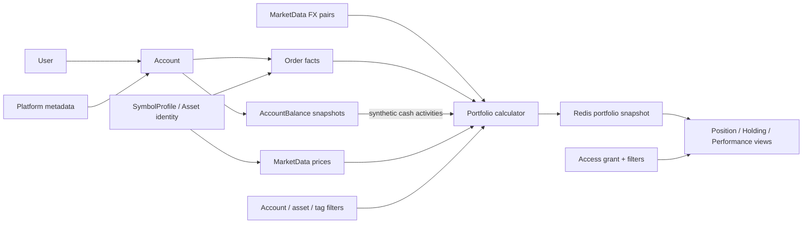

# Ghostfolio 开源项目研究：从财富管理实现反证 Investment Tracker 的领域边界

> 研究日期：2026-08-11
>
> 固定版本：Ghostfolio `3.47.0`，commit [`8d733b070b78debde7604a7fd86232a57135e28c`](https://github.com/ghostfolio/ghostfolio/tree/8d733b070b78debde7604a7fd86232a57135e28c)（2026-08-10）
>
> 研究范围：官方仓库的 README、Prisma schema、交易 / 导入 / 组合计算 / 汇率 / 权限 / 后台任务等实现；不评价商业版未公开能力。
>
> 证据标记：**[事实]** 表示固定 commit 中可直接验证；**[源码推断]** 表示由多个实现细节归纳；**[本项目判断]** 表示对 Investment Tracker 的产品或领域启示，不是 Ghostfolio 的自述。

## 0. 先给结论

Ghostfolio 是一个成熟度较高的 Web 财富管理与投资组合分析系统。它最强的部分不是“投资日记”，而是把账户、资产、交易、现金、市场价格与汇率组织成可重算的投资组合快照，再围绕配置、绩效、基准和静态风险检查提供查询体验。它支持多账户、多币种、导入导出、共享与自托管，但不是 local-first，也没有券商同步、完整公司行动账本、交易批次成本法或投资论点生命周期。

这轮研究同时验证和修正了 Wealthfolio 研究中的若干认识：

- **[事实]** Account、Asset、Activity/Order 是明确的数据边界，Position/Holding/Performance 是重放活动与行情后得到的派生结果。
- **[事实]** Ghostfolio 没有持久化的命名 `Portfolio` 实体；“组合”主要是“某用户的全部事实 + 账户 / 资产 / 标签等过滤条件”的计算范围。
- **[事实]** 现金也没有被建模为普通 Order；系统保存账户余额时间序列，计算时再生成合成的现金买卖活动。
- **[事实]** 分红和费用是一等交易类型；内部现金转移只改写两个账户的余额历史，没有持久化为一对可追溯事件；拆股虽有 schema 与管理服务脚手架，当前 UI 明确禁用且不进入组合计算。
- **[事实]** 默认且唯一真正实现的绩效算法是 ROAI。TWR、MWR、ROI 类仍会抛出“未实现”错误；ROAI 把分红单列，不把它并入该算法的净价格绩效。
- **[本项目判断]** Wealthfolio 的“事实与派生分离”方向被强化，但“Portfolio 必须是一等持久化实体”“现金必须与证券交易共用一种活动模型”“成熟产品自然会提供 Lot / 全套公司行动”等假设不成立。
- **[本项目判断]** 对 Investment Tracker 而言，`InvestmentCase` 继续适合作为独立于账户、持仓和成交的候选聚合；Ghostfolio 恰好说明：财务事实系统可以独立运转，但无法替代投资理由、假设、证据、修订和复盘条件。

## 1. 产品定位：财富管理系统，不是投资论证系统

**[事实]** 官方 README 将 Ghostfolio 定位为面向个人投资者的开源财富管理软件，强调跨平台资产跟踪、买入并持有、组合洞察、隐私与数据所有权、财务独立。公开功能包括交易增删改查、多账户、绩效与图表、静态风险分析、导入导出和 PWA；服务端由 Angular、NestJS、PostgreSQL、Prisma、Redis 组成，并提供 Docker 自托管方式。[README](https://github.com/ghostfolio/ghostfolio/blob/8d733b070b78debde7604a7fd86232a57135e28c/README.md)

**[本项目判断]** 从公开定位与功能重心看，它的核心用户是需要长期汇总多个账户和资产、查看财富变化与组合风险的个人投资者，尤其偏向 buy-and-hold，而非依赖逐笔执行复盘的高频交易者。类别上以 **Portfolio Tracker + Wealth Management** 为主，兼有部分 Personal Finance；它不是 Trading Journal，也不是 Investment Research 系统。

| 项目 | 主要关注点 | 与 Ghostfolio 的关键差异 |
| --- | --- | --- |
| TradeNote | execution、逻辑交易、日记、标签与交易绩效 | 更围绕交易行为和复盘；Ghostfolio 更围绕长期持仓、财富聚合与账户配置 |
| Wealthfolio | local-first 的个人投资组合事实与派生分析 | 领域方向最接近；但 Wealthfolio 持久化命名 Portfolio、强调 Lot / Activity 分层，Ghostfolio 是服务端多用户架构且 Portfolio 多为计算范围 |
| Ghostfolio | 多账户财富汇总、估值、绩效、配置、风险和分享 | reasoning / evidence lifecycle 基本缺席 |

**[源码推断]** Ghostfolio 的核心用户问题是“我现在拥有什么、价值多少、如何变化、风险集中在哪里”，而不是“我当初为何投资、哪些假设仍成立、什么证据改变了判断”。它具备评论、标签和一个生成通用组合提示词的 AI 邻接功能，但没有 Thesis、Conviction、Assumption、Evidence、Revision、Review Condition 或 Decision Quality 等模型和流程。

**[本项目判断]** 因而 Ghostfolio 适合用来验证 Financial Reality 层的成熟实现，并用其缺口反证 Investor Reasoning 与 Evidence & Review 的独立价值；不应把它当作 Investment Tracker 产品形态的直接模板。

## 2. 核心领域模型与数据流

### 2.1 核心对象逐项核对

**[事实]** 下表按固定版本 schema 与计算路径区分持久化事实、参考数据和派生状态：

| 对象 | 现实概念 | 是否持久化 / identity | 主要关联 | 性质 |
| --- | --- | --- | --- | --- |
| `User` | 登录主体与数据所有权根 | 是；UUID | Account、Order、Access、Settings | 所有权 / 安全事实 |
| `Account` | 用户名下的投资或现金账户 | 是；复合主键 `id + userId` | User、Platform、Order、AccountBalance、Tag | canonical fact |
| `Platform` / Broker | 券商、银行或平台的共享元数据 | 是；UUID，URL 全局唯一 | 一个 Platform 对多个 Account | reference fact；不是同步连接 |
| `Portfolio` | 一次组合聚合与分析的范围 | 无 Portfolio 表；运行时由 userId + filters 标识；Access 可保存分享范围 | Account、Asset、Tag filters、Access | derived scope，不是 canonical fact |
| `Order` / Transaction / Activity | 一笔买卖、分红、费用、利息或负债活动 | 是；UUID | User、可选 Account、SymbolProfile、Tag | canonical fact |
| `SymbolProfile` / Asset / Symbol | 可被活动与行情共同引用的资产档案 | 是；UUID；唯一约束 `dataSource + symbol` | Order、MarketData、Split、Resolution | reference / identity fact |
| `Position` / `Holding` | 某计算范围内的资产数量、成本、价值和绩效视图 | 否；快照中按符号等运行时键组织 | Order、MarketData、FX、filters | derived state |
| `AccountBalance` / Cash | 账户在某日的现金余额观察值 | 是；UUID，且 `accountId + date` 唯一 | Account；计算时产生合成现金活动 | canonical balance fact；合成活动为 derived |
| Currency | 账户、交易、资产报价和报告基准的货币代码 | 无独立实体；作为多个字段的代码值持久化 | Account、Order、SymbolProfile、UserSettings、FX | value semantics / reference fact |
| Exchange | 证券上市地 / 交易所 | 无一等模型或 MIC identity | 通常隐含在 provider-specific symbol 中 | 未独立表达 |
| Asset Class | 资产大类与子类分类 | 是；枚举值存于 SymbolProfile | Asset、配置与 X-Ray 分析 | reference classification |
| `MarketData` / Quote | 某数据源中某符号某日的价格；也用于历史 FX | 是；UUID，唯一约束 `dataSource + date + symbol` | SymbolProfile 语义、计算器、provider | canonical market reference fact |
| Dividend / Fee | 分红收入与费用活动 | 是；各自使用 Order UUID | Account、Asset、User | canonical activity fact |
| Corporate Action | 拆股、合并、分拆、改名等证券生命周期事件 | 仅 Split 脚手架持久化；UUID；其他无模型 | SymbolProfile | Split 尚不参与计算；整体未成熟 |
| `Access` | 私有或公开分享某用户组合范围的授权 | 是；UUID | owner、grantee、filters | access-control fact，不是 Portfolio |
| `AssetProfileResolution` | 一个提供方符号到另一提供方符号的解析 / 映射 | 是；来源 provider + symbol 唯一 | SymbolProfile / provider | reference mapping fact |

上述对象均可在固定版本的 [Prisma schema](https://github.com/ghostfolio/ghostfolio/blob/8d733b070b78debde7604a7fd86232a57135e28c/prisma/schema.prisma) 中核验。

### 2.2 事实、参考数据与派生结果

**[事实]** `Order` 和 `AccountBalance` 保存在 PostgreSQL；Position、Holding 与 PortfolioSnapshot 不是 Prisma 表。计算器重放活动、现金余额、历史价格与汇率，将结果缓存到 Redis；交易变更事件会删除该用户的快照缓存并触发后台重算。[Activities service](https://github.com/ghostfolio/ghostfolio/blob/8d733b070b78debde7604a7fd86232a57135e28c/apps/api/src/app/activities/activities.service.ts) · [Portfolio calculator](https://github.com/ghostfolio/ghostfolio/blob/8d733b070b78debde7604a7fd86232a57135e28c/apps/api/src/app/portfolio/calculator/portfolio-calculator.ts) · [Portfolio changed listener](https://github.com/ghostfolio/ghostfolio/blob/8d733b070b78debde7604a7fd86232a57135e28c/apps/api/src/events/portfolio-changed.listener.ts)

**[源码推断]** Ghostfolio 内部实际有三种数据性质：规范财务事实、资产 / 行情参考数据、可丢弃并重建的分析读模型。这个细分比只说“事实 / 派生”更精确。

## 3. 对 Wealthfolio 十项结论的交叉验证

**[本项目判断]** 下表以两边固定版本实现为证据，对概念是否相同作研究归类：

| Wealthfolio 观察 | Ghostfolio 证据 | 结论 |
| --- | --- | --- |
| 1. Account 是一等对象 | Account 拥有币种、余额、活动、Platform、标签并按用户隔离 | **概念一致，实现不同**：Ghostfolio 没有归档生命周期 |
| 2. Asset 独立于 Account | 多个账户的 Order 可引用同一 SymbolProfile | **基本一致** |
| 3. Activity 是规范事实 | Order 是证券活动事实；现金却保存为 AccountBalance | **概念一致但边界不同**：不是所有财务变化都统一成 Activity |
| 4. Position / Holding 为派生 | 计算器重放 Order、现金、行情与 FX 后生成快照 | **强验证** |
| 5. Portfolio 是持久化账户范围 | 无 Portfolio 表；用户事实加过滤条件形成计算范围 | **明显反例**：Portfolio 可以只是查询 / 权限作用域 |
| 6. Cash 纳入组合事实 | 账户余额历史持久化，计算时生成币种资产的合成活动 | **概念一致，实现不同** |
| 7. Dividend / Fee / Transfer 是显式活动 | Dividend、Fee 是类型；内部现金转移不是持久化事件 | **部分验证、部分反例** |
| 8. 多币种角色必须区分 | 账户、交易、资产报价和用户基准币种彼此分离 | **强验证** |
| 9. Quote / FX 是独立市场事实 | MarketData 保存价格和历史 FX；提供方负责刷新 | **强验证，存储结构不同** |
| 10. 历史修正后可重算 | Order 原地修改 / 删除后清缓存并重算 | **概念一致，实现不同**：可重算但无修订审计 |

**[本项目判断]** 两个项目共同验证的不是某一套表结构，而是一组更稳定的领域原则：账户边界、稳定资产引用、规范经济事实、明确的币种角色、行情 / 汇率事实、以及可从事实重建的持仓和绩效。

Ghostfolio 对 Wealthfolio 结论提出了四个重要挑战：

1. Portfolio 未必需要持久化；如果它只是过滤、分享和分析范围，查询作用域即可成立。
2. 现金未必需要复用证券 Activity；余额快照也能支持当前净值，但会牺牲转移、来源和对账的事件追溯能力。
3. 简化型个人财富工具可以在没有 Lot、成本法选择和完整公司行动引擎的情况下提供有用分析。
4. `dataSource + symbol` 足以支撑一个产品，但不等于跨数据源、跨市场、跨时间稳定的资产身份。

## 4. Transaction / Order：规范事实的强项与缺口

### 4.1 支持的经济类型

**[事实]** `Order.Type` 只有 `BUY`、`SELL`、`DIVIDEND`、`FEE`、`INTEREST`、`LIABILITY` 六类。创建 DTO 包含账户、资产类别、评论、交易币种、日期、费用、数量、符号、标签、类型和单价；非投资类型可省略市场数据源。[Schema](https://github.com/ghostfolio/ghostfolio/blob/8d733b070b78debde7604a7fd86232a57135e28c/prisma/schema.prisma) · [CreateOrderDto](https://github.com/ghostfolio/ghostfolio/blob/8d733b070b78debde7604a7fd86232a57135e28c/libs/common/src/lib/dtos/create-order.dto.ts)

| 请求核对的类型 | 固定版本表达 |
| --- | --- |
| BUY / SELL | 一等 Order 类型 |
| DIVIDEND / INTEREST / FEE | 一等 Order 类型 |
| LIABILITY | 一等 Order 类型，用于负债相关活动 |
| TRANSFER | 不是 Order 类型；现金转移直接调整两个账户的余额历史 |
| DEPOSIT / WITHDRAWAL | 没有专用 Order 类型；可通过 AccountBalance 变化反映现金结果，但丢失事件语义 |
| SPLIT / REVERSE SPLIT | 不是 Order；有 Split 档案脚手架，但未进入组合计算 |
| MERGER / SPIN-OFF / SYMBOL CHANGE / RETURN OF CAPITAL | 没有一等交易或公司行动类型 |

**[事实]** Order 使用 UUID，创建后有稳定内部身份；但没有 broker、source transaction id、import batch id、source row、原始载荷或修订版本字段。`dataSource` 表示行情提供方，不表示交易来源。

**[事实]** 修改是原地更新，删除是物理删除；两者都会触发组合缓存失效和重算，但不会留下“谁在何时为何改了哪一项”的领域审计链。

### 4.2 买卖与成本基础

**[事实]** 核心计算器按交易顺序维护数量与投资额：买入增加投入，卖出按当前平均成本减少投入，数量归零时重置。默认 ROAI 计算器也维护加权平均意义上的成本状态；数据库中没有 Lot，也没有 FIFO/LIFO/特定批次选择。[Core calculator](https://github.com/ghostfolio/ghostfolio/blob/8d733b070b78debde7604a7fd86232a57135e28c/apps/api/src/app/portfolio/calculator/portfolio-calculator.ts) · [ROAI calculator](https://github.com/ghostfolio/ghostfolio/blob/8d733b070b78debde7604a7fd86232a57135e28c/apps/api/src/app/portfolio/calculator/roai/portfolio-calculator.ts)

**[源码推断]** 这更接近“面向组合趋势的加权平均分析”，不是税务级成本基础账本。卖出贡献会在计算过程中进入绩效，但没有可查询、可审计的已实现收益实体或 lot disposal 记录。

### 4.3 现金转移

**[事实]** Account API 提供现金余额转移操作，它调整来源与目标账户的 AccountBalance 历史；系统没有持久化 Transfer 事件、配对 ID、手续费、在途状态或撤销关系。[Account service](https://github.com/ghostfolio/ghostfolio/blob/8d733b070b78debde7604a7fd86232a57135e28c/apps/api/src/app/account/account.service.ts)

**[本项目判断]** 若 Investment Tracker 未来承诺券商对账或跨账户资金路径，Ghostfolio 的余额快照方式不够；若首期只需要解释当前组合价值，它却证明了无需先造完整复式账本。

**[本项目判断]** 与 Wealthfolio 相比，两者都把经济活动置于持仓之前；Ghostfolio 的 Order 类型更薄、现金另走余额快照，也没有 Wealthfolio 式 Lot / Transfer 事件深度与导入来源边界。共同点是“编辑事实后重建派生状态”，而不是共同的表结构。

## 5. Asset Identity：有稳定内部 ID，但仍与提供方耦合

**[事实]** `SymbolProfile` 有 UUID 内部主键，Order 通过该主键引用资产；同一资产可以跨多个账户复用。数据库层面的资产唯一性却由 `dataSource + symbol` 决定。档案还可保存 ISIN、CUSIP、FIGI、币种、资产类别 / 子类、国家、行业、持仓成分和符号映射。[Schema](https://github.com/ghostfolio/ghostfolio/blob/8d733b070b78debde7604a7fd86232a57135e28c/prisma/schema.prisma) · [Symbol profile service](https://github.com/ghostfolio/ghostfolio/blob/8d733b070b78debde7604a7fd86232a57135e28c/apps/api/src/services/symbol-profile/symbol-profile.service.ts)

**[事实]** 自定义资产使用 `MANUAL` 数据源和生成的 UUID 符号，并归属于创建用户。`AssetProfileResolution` 与 `symbolMapping` 提供部分跨源映射能力。

**[事实]** 没有 Exchange / MIC 一等模型，也没有证券身份随时间变化的历史。不同交易所通常依赖行情提供方自己的符号约定；管理员可以原地改写资产的 `dataSource + symbol` 及相应行情。

**[源码推断]** 核心组合计算的一些映射按 `symbol` 而不是 `symbolProfileId` 或 `dataSource + symbol` 建键，因此两个提供方若出现同名符号，存在发生聚合碰撞的可能。该风险来自实现路径，并不表示已观察到生产事故。

**[本项目判断]** Ghostfolio 验证了“Asset 必须独立于 Account 并有稳定引用”，但没有推翻 Wealthfolio 提出的更强要求：面向多市场、多提供方和长期历史时，内部资产身份、上市证券身份、交易所身份与提供方符号映射最好明确分层。

## 6. Account、Platform 与 Portfolio Scope

### 6.1 Account / Platform

**[事实]** 用户可拥有多个 Account；每个账户最多关联一个 Platform，一个 Platform 可被多个账户引用。Platform 只有名称、URL 等机构元数据，不保存券商授权、同步游标或连接状态。

**[事实]** Account 有可选币种、名称、评论、余额与标签，没有 active / archived 状态。有活动的账户不能删除；“Exclude from Analysis”是标签驱动的分析排除，不是归档。

### 6.2 Portfolio 不是实体

**[事实]** Prisma schema 不存在 Portfolio 模型。PortfolioService 默认计算一个用户的整体组合，并可按账户、资产类别、数据源、符号和标签过滤。Access 记录可把类似过滤条件保存为共享范围。[Portfolio service](https://github.com/ghostfolio/ghostfolio/blob/8d733b070b78debde7604a7fd86232a57135e28c/apps/api/src/app/portfolio/portfolio.service.ts) · [Access service](https://github.com/ghostfolio/ghostfolio/blob/8d733b070b78debde7604a7fd86232a57135e28c/apps/api/src/app/access/access.service.ts)

**[源码推断]** Ghostfolio 的 Portfolio 更像“计算语境”：所有权根是 User，Account 是事实分区，过滤器决定这次分析的范围，Access 决定谁能看这个范围。

**[本项目判断]** Investment Tracker 不应仅因行业词汇常见就预设 `Portfolio` 表。只有当用户确实需要命名、保存、比较、授权或设定目标的稳定组合边界时，它才值得成为聚合；否则 Account scope 或 saved filter 可能更简单。

**[本项目判断]** 当前证据倾向于让 Account 成为 InvestmentCase 的 context / link，而非 owner：同一判断可能跨多个账户的同一资产延续。不过 Case 是否绑定资产、仓位、主题或某次建仓仍需用户研究，本轮不作最终结论。

## 7. Holding 与 Performance：可重算分析，而非账本真相

### 7.1 Holding / Position

**[事实]** PortfolioSnapshot 包含 positions、historicalData、totalCash、fees、interest、investment、liabilities 等计算结果并缓存于 Redis。PortfolioService 再把 positions 变成 Holding 视图，计算数量、均价、当前价值、分红、费用、绩效和相对组合价值的配置比例。

**[事实]** 数量由活动顺序累加，平均成本来自运行时维护的投入额 / 数量状态。卖出相对当前均价的贡献在绩效计算中处理，但没有持久化 realized P&L；当前价格相对成本形成的未实现变化也只是快照 / Holding 输出的一部分，不是账本实体。

**[事实]** 结果可以按账户、资产、数据源、标签等范围重算。同一个 Asset 因此可以在不同账户范围、全局范围或分享范围中呈现不同的 Holding 聚合。

**[本项目判断]** Position/Holding 不应承载 InvestmentCase 的生命周期。持仓可因买卖归零、转移或过滤范围变化而消失，投资判断却可能在建仓前形成、清仓后继续复盘，并跨多个账户的同一资产延续。

### 7.2 绩效口径

**[事实]** 设置中默认使用 ROAI，且固定版本只有 ROAI 真正实现。TWR、MWR、ROI 的计算器入口存在，但方法直接抛出未实现错误；因此不能把这些类的存在当成功能支持。[TWR stub](https://github.com/ghostfolio/ghostfolio/blob/8d733b070b78debde7604a7fd86232a57135e28c/apps/api/src/app/portfolio/calculator/twr/portfolio-calculator.ts) · [MWR stub](https://github.com/ghostfolio/ghostfolio/blob/8d733b070b78debde7604a7fd86232a57135e28c/apps/api/src/app/portfolio/calculator/mwr/portfolio-calculator.ts)

**[事实]** ROAI 中费用从净绩效扣除，分红与利息单独累积。测试与实现均显示分红不会并入该算法的 `netPerformance` 价格收益，所以这里的“净绩效”不是分红再投资意义上的总回报。

**[事实]** 历史表现由活动、行情和历史 FX 重建。基准服务可将配置的基准资产价格趋势与用户组合表现按日期对齐并进行币种换算；X-Ray 则对流动性、应急资金、币种 / 资产 / 账户 / 地域集中度和费用运行静态规则。[Benchmark service](https://github.com/ghostfolio/ghostfolio/blob/8d733b070b78debde7604a7fd86232a57135e28c/apps/api/src/app/endpoints/benchmarks/benchmarks.service.ts)

**[本项目判断]** “有绩效数字”不等于“绩效语义已完备”。Investment Tracker 若未来展示收益，必须把公式、现金流口径、分红处理、费用、汇率和时间范围显式化，而不是直接复制字段名。

**[本项目判断]** 与 Wealthfolio 的 `Activity → Lot → Position → Holding → Performance` 相比，Ghostfolio 更接近 `Order + AccountBalance → 内存成本状态 / Position → Holding / Performance`：事实与派生边界一致，但没有 Lot 层，绩效口径也更集中在 ROAI。

## 8. Corporate Actions：分红成熟，其他行动不足

**[事实]** 固定版本对各类公司行动的实际覆盖如下：

| 行动 | Ghostfolio 固定版本 | 研究判断 |
| --- | --- | --- |
| Dividend | 一等 Order 类型 | 可进入现金 / 分红分析，但与 ROAI 净价格绩效分列 |
| Fee / Interest | 一等 Order 类型 | 可显式累计 |
| Split / Reverse Split | 有日期、分子、分母 schema 与服务 | UI 明确禁用且未进入组合计算，不能视作已支持 |
| Merger / Acquisition | 无一等类型或实体 | 只能人工改写事实，缺少语义与审计 |
| Spin-off | 无一等类型或实体 | 同上 |
| Symbol change | 可原地改 SymbolProfile | 没有生效日期和身份沿革 |
| Return of capital | 无专用类型 | 用现有类型近似会丢失税务 / 成本语义 |

拆股状态可从 [AssetProfileSplit schema](https://github.com/ghostfolio/ghostfolio/blob/8d733b070b78debde7604a7fd86232a57135e28c/prisma/schema.prisma) 与 [disabled management UI](https://github.com/ghostfolio/ghostfolio/blob/8d733b070b78debde7604a7fd86232a57135e28c/apps/client/src/app/components/admin-market-data/asset-profile-dialog/asset-profile-dialog.html) 交叉核验。

**[本项目判断]** 公司行动是 Financial Reality 的长期完整性问题，但不是 Investment Tracker v0.1 必须一次解决的能力。更重要的是先避免把 BUY/SELL 两类硬编码成永远不变的封闭世界，并保留修正、来源和未来扩展空间。

## 9. 多币种：角色分离清晰，汇率仍需理解其语义

**[事实]** Ghostfolio 至少明确区分四种币种角色：

- `Account.currency`：账户 / 现金语境币种；
- `Order.currency`：该笔经济活动的交易币种；
- `SymbolProfile.currency`：资产报价币种；
- `UserSettings.baseCurrency`：用户组合报告基准币种。

**[事实]** 历史 FX 以 MarketData 形式由配置的数据提供方持久化，组合计算支持直接汇率或经默认币种桥接；缺失日期会采用最近的此前可用汇率。当前汇率另有内存缓存并定期刷新。活动金额按活动日期汇率换算，绩效结果还区分 currency effect 与非币种效应。[Exchange rate service](https://github.com/ghostfolio/ghostfolio/blob/8d733b070b78debde7604a7fd86232a57135e28c/apps/api/src/services/exchange-rate-data/exchange-rate-data.service.ts)

**[源码推断]** Account.currency 并不强制所有 Order 使用同一币种；它更偏向账户现金和展示语境。系统的正确性来自各金额值携带自己的币种含义，而不是“账户上只有一个 currency 字段”。

**[本项目判断]** 这与 Wealthfolio 对交易币种、资产报价币种、账户 / 组合基准币种和历史 FX 的区分基本同向；不同之处是 Ghostfolio 将历史 FX 复用 MarketData、现金由账户余额快照表达，并明确计算 currency effect。

**[本项目判断]** v0.1 当前模型没有币种字段，是 Financial Reality 最明确的结构缺口之一。未来不一定需要先建 `Currency` 实体，但每个金额必须知道数值币种、换算币种、汇率日期与来源。

## 10. 导入、数据提供方与可追溯性

### 10.1 导入流程

**[事实]** Ghostfolio 支持与自身导出格式兼容的 JSON 导入，内容可包含账户、活动、资产档案及行情、平台和标签；也支持通用 CSV，前端用多组表头别名解析成 CreateOrderDto，再由服务端验证、预览和创建。ISIN 可以用于解析提供方符号，缺省数据源会使用系统默认提供方。[Import service](https://github.com/ghostfolio/ghostfolio/blob/8d733b070b78debde7604a7fd86232a57135e28c/apps/api/src/app/import/import.service.ts) · [Client CSV parser](https://github.com/ghostfolio/ghostfolio/blob/8d733b070b78debde7604a7fd86232a57135e28c/apps/client/src/app/services/import-activities.service.ts)

**[事实]** 导入有 dry-run / preview 式校验；错误行不会直接进入创建阶段。未看到用于券商自动同步的适配器、连接模型、游标或来源账户映射。

**[事实]** Order 不保存导入批次、源文件、源行、外部交易 ID 或原始值。成功导入后，记录只剩规范化字段，无法从数据库反查“这笔事实来自哪次导入的哪一行”。

**[源码推断]** 重复判断比较评论、币种、数据源、秒级日期、费用、数量、符号、类型与单价，但未纳入 accountId 和标签；因此两个账户中完全相同的经济记录可能被误判为重复。这里是静态源码推断，不是已复现的用户故障。

### 10.2 行情提供方边界

**[事实]** 数据提供方接口处理符号搜索、资产档案、日期范围和行情；组合数量、账户名称和完整交易行不是其常规行情查询参数。第三方提供方因此主要看到“查哪个资产 / 哪段时间”，而不是整个用户账本。[Data provider interface](https://github.com/ghostfolio/ghostfolio/blob/8d733b070b78debde7604a7fd86232a57135e28c/apps/api/src/services/data-provider/interfaces/data-provider.interface.ts)

**[源码推断]** 市场数据提供方与交易来源是两个完全不同的概念；Ghostfolio 对前者建模充分，对后者几乎没有 provenance。这一点对 Investment Tracker 尤其重要，因为未来的证据引用和决策复盘同样需要“来源是什么、何时取得、原文 / 原值是什么”。

## 11. Web、多用户与后台重算架构

**[事实]** Ghostfolio 是典型服务端 Web 架构：Angular PWA 通过 NestJS REST API 访问 PostgreSQL；Redis 用于缓存、限流与 Bull 后台队列。组合变更监听器做短暂防抖后删除该用户的相关快照，并异步重算默认组合。行情还有定时刷新任务。[AppModule](https://github.com/ghostfolio/ghostfolio/blob/8d733b070b78debde7604a7fd86232a57135e28c/apps/api/src/app/app.module.ts) · [Snapshot processor](https://github.com/ghostfolio/ghostfolio/blob/8d733b070b78debde7604a7fd86232a57135e28c/apps/api/src/services/queues/portfolio-snapshot/portfolio-snapshot.processor.ts)

**[事实]** 认证覆盖匿名安全令牌、Google OAuth、实验性 OIDC、WebAuthn / passkey 和 API key 场景。大多数用户事实查询显式限定 `userId`；账户使用包含 userId 的复合键。SymbolProfile 与 MarketData 多数是全局共享参考数据，自定义资产例外地记录所有者。

**[事实]** Access 支持 READ / READ_RESTRICTED 的私有或公开分享，保存过滤条件；受限模式通过响应拦截器隐藏金额。公开接口仍可能暴露配置、绩效和最近活动等经过权限规则处理的数据，因此共享并不只是一个静态截图。

**[源码推断]** 对一个单用户投资工具而言，多用户 Web 化新增的复杂度至少包括：认证恢复、租户隔离、访问授权与撤销、公开链接、敏感缓存、任务幂等与排队、行情限流、数据库迁移、服务健康、日志、备份恢复和安全更新。固定仓库提供 Docker volume 和健康 / 队列管理基础，但未看到开箱即用的自动备份与完整可观测性平台。

**[本项目判断]** 这些是交付与运行复杂度，不是需要新建“第四领域层”的理由。Investment Tracker 在产品价值尚未验证前，不应把 Ghostfolio 的 SaaS 运维面等同于领域模型成熟度。

## 12. 隐私、安全与本地优先

**[事实]** 官方提供 Docker 自托管；示例使用 PostgreSQL 持久卷、Redis 密码、容器 capability 收缩和 no-new-privileges 等配置。自托管把应用、数据库与缓存交给部署者控制，但仍然是服务器中心架构。[Docker Compose](https://github.com/ghostfolio/ghostfolio/blob/8d733b070b78debde7604a7fd86232a57135e28c/docker/docker-compose.yml)

**[事实]** 托管或自托管实例都需要把用户交易与账户数据存入 PostgreSQL，并将派生快照放进 Redis；浏览器不是事实数据的唯一权威副本。因此 Ghostfolio 不能称为 local-first。

**[本项目判断]** 这与 Wealthfolio 的 local-first 边界明显不同：Wealthfolio 把个人设备上的本地数据作为首要权威，Ghostfolio 则把服务端数据库作为权威。自托管改变操作者和信任边界，但不改变其 server-first 数据流。

**[事实]** 仓库中的隐私政策声明不使用广告 / 分析 Cookie，并描述服务运行所需的数据处理与尽力而为的安全措施。那是政策承诺，不应和架构保证混为一谈。[Privacy policy](https://github.com/ghostfolio/ghostfolio/blob/8d733b070b78debde7604a7fd86232a57135e28c/apps/client/src/assets/privacy-policy.md)

**[源码推断]** 行情接口通常向外部提供方发送符号、查询和日期范围，而不是完整账户；可选 AI 健康检查可调用 OpenRouter。只要启用外部服务，部署者仍需逐项评估元数据、API key、日志和请求内容，而不能仅凭“self-hosted”推断零数据外流。

**[本项目判断]** 对 Investment Tracker，隐私决策应拆成三题：事实数据放在哪里、哪些衍生请求会离开信任边界、用户是否能导出 / 删除 / 备份。local-first、self-hosted 和 privacy-friendly 是三种不同承诺。

## 13. 对 Investor Reasoning 的直接检验

**[事实]** 固定版本中没有 Investment Journal、投资论点、信念强度、关键假设、证据、反证、修订历史、复盘条件或决策质量的领域模型。最接近的能力是：

- Order、Account、SymbolProfile 上的自由文本 comment；
- Account / Order 标签；
- X-Ray 的固定组合风险规则；
- AI 服务构造一张包含名称、符号、币种、资产分类和配置比例的持仓表，并请求通用的组合概览、风险与优化建议。

AI 相邻实现可见 [AI service](https://github.com/ghostfolio/ghostfolio/blob/8d733b070b78debde7604a7fd86232a57135e28c/apps/api/src/app/endpoints/ai/ai.service.ts)。

**[源码推断]** comment 和 tag 能记录只言片语，却没有冻结版本、结构化假设、证据引用、有效期、触发条件或决策时点，因此不能形成可审计的判断演化链。通用 AI 提示也没有持久化、版本化、证据绑定或 InvestmentCase 上下文。

**[本项目判断]** 这正是 Investment Tracker 的差异化空间：不必在组合计算上复制 Ghostfolio 的全部深度，而应把“当时基于什么事实做了什么判断、后来什么证据改变了它、结果与决策质量如何区分”做成第一等产品能力。

## 14. 对三层候选领域划分的再评估

### 14.1 Financial Reality

**结论：保留，但内部应再区分规范事实、参考事实与派生分析。**

**[本项目判断]** Ghostfolio 给出的最小候选集合是：

- 规范事实：Account、Activity / Transaction、Cash 或 AccountBalance；
- 参考事实：Asset identity、Price / Quote、FX rate；
- 派生结果：Position、Holding、Allocation、Performance；
- 云端场景的横切边界：User ownership、Access、cache invalidation。

Platform、持久化 Portfolio、完整 Corporate Action、ImportRun、Lot 不应仅因成熟产品可能需要就自动进入 v0.1。Currency 更可能先作为 Money / Rate 的明确值语义，而非独立聚合。

### 14.2 Investor Reasoning

**结论：继续独立，且独立性的证据更强。**

**[本项目判断]** Ghostfolio 说明财务事实与组合分析可以在完全没有投资论点模型的情况下成立；反过来，InvestmentCase 也不应被某一笔 Order 或某一时刻 Holding 吞并。更合理的候选关系是：一个 Case 引用一个或多个 Asset / 主题，可关联多个账户中的活动与持仓快照，并拥有自身的状态、论点、假设、风险、退出 / 复盘条件和版本历史。最终基数仍需用户研究，而不是靠仓库决定。

### 14.3 Evidence & Review

**结论：继续独立，但首期可以很薄。**

**[本项目判断]** 行情来源、导入来源和 AI 输出都说明 provenance 不能事后补成一个 URL 字段。首期至少应能表达：证据内容或摘要、来源、取得 / 发布时点、它支持或反驳哪个假设、以及用户何时确认。复杂监控、自动提取和多智能体分析可以后置。

### 14.4 是否需要第四层

**结论：当前不需要。**

**[本项目判断]** Web 认证、共享、队列、缓存、迁移、备份和可观测性是运行平台的横切关注点，不是与三层并列的投资领域。若未来多人协作成为核心产品，Identity & Collaboration 可以成为独立 bounded context；本轮证据还不足以做该决定。

### 14.5 已较确定的分离与仍不确定的关系

**[本项目判断]** 目前较确定不应混在同一个可覆盖记录中的对象是：Activity 事实与 InvestmentCase 判断、Asset identity 与 Account、MarketData / FX 与用户交易、Position / Performance 派生值与规范事实、Evidence 来源与 AI / 用户摘要、Outcome 与 Decision Quality。

**[本项目判断]** 仍高度不确定的是：一个 Case 对一个 Asset 还是多个 Asset；同一资产再次建仓是否复用 Case；Case 与 Account / Position / Activity 的基数；Cash 是事件账本还是余额观察；Portfolio 是否需要持久化；Evidence 自动化程度；以及 ReviewCondition 的表达与提醒频率。

## 15. 成熟组合能力：借鉴、复用、自建与非 MVP

**[本项目判断]** Wealthfolio 与 Ghostfolio 的共同实现足以说明下列问题已是成熟 Portfolio Tracking 领域问题，但“问题成熟”不代表存在唯一标准解法。

| 能力 | 两项目交叉确认 | 概念可借鉴 | 可复用库 / 服务 | 仍可能自建 | MVP 判断 |
| --- | --- | --- | --- | --- | --- |
| Account | 都是一等事实边界 | 是 | 通用 CRUD 价值低 | 账户语义、归档 / 对账规则 | 最小版本需要 |
| Asset identity | 都独立于 Account 并被活动引用 | 是 | 标识解析 / 行情 provider 可复用 | 中国市场映射、身份沿革、冲突处理 | 最小稳定 ID 需要 |
| Transaction ledger | 都以活动先于持仓 | 是 | 金额 / 日期基础库可复用 | 类型语义、修订、provenance | 最小版本需要 |
| Cash | 都进入组合价值，但表达不同 | 是 | 未见通用方案可直接替代领域选择 | 余额快照还是事件账本、转移对账 | 可做最小表达 |
| Quote / FX | 都是独立于用户交易的参考事实 | 是 | 行情、FX provider 与缓存可复用 | point-in-time、来源、资产匹配 | 实时报价可后置，币种语义不能后置 |
| Position / valuation | 都由事实与行情派生并可重算 | 是 | 数值 / 时间序列库可复用 | 目标口径与异常修复 | 最小数量 / 市值可逐步加入 |
| Performance | 都需处理现金流、费用、汇率和时间 | 公式边界可借鉴 | 经验证的收益率库可能可用 | 产品口径、解释和测试 | 高级绩效非 MVP |
| Asset allocation | 都按派生市值与分类聚合 | 是 | 图表库可复用 | 分类体系与未知资产策略 | 非核心 MVP |
| Import / reconciliation | 都有解析、映射、校验、去重 | 流程可借鉴 | CSV parser 可复用 | 券商映射、批次 / 行来源、对账 | 手工录入后再做 |
| Lot / Corporate Action | 长期必要性明确，但两边成熟度并不一致 | 只借边界意识 | 将来评估专用库 / 数据源 | 本地税务与历史修复语义 | 完全非 MVP |
| Web multi-user platform | Ghostfolio 展示了完整复杂度，Wealthfolio 选择避开 | 可借复杂度地图 | Auth、OIDC、WebAuthn、队列、迁移 | 权限、隐私与运行策略 | 当前非 MVP |

**[本项目判断]** “复用服务”不意味着把关键语义外包。例如行情值可来自第三方，但资产匹配、有效日期、币种、来源和修订策略仍是本项目必须掌握的领域责任。

## 16. 对当前 Investment Tracker v0.1 的含义

当前 v0.1 的 `InvestmentRecord` 把成交事实、投资理由、市场上下文、论点、风险、退出条件和复盘写在同一 SQLite 行中，只支持 BUY / SELL，以 `symbol + market` 文本识别资产，并允许原地覆盖更新。

**[本项目判断]** 与 Ghostfolio 和 Wealthfolio 交叉后，主要边界风险是：

1. **事实与判断混写**：修正成交价格可能和改写历史论点走同一更新路径，无法区分事实纠错与认知演化。
2. **缺少 Account**：无法表达同一资产在多个券商 / 账户的持仓、现金与绩效范围。
3. **缺少稳定 Asset**：文本 symbol + market 难以处理跨市场标识、改名、数据源符号和同资产跨账户复用。
4. **事件类型过窄**：BUY / SELL 无法自然承载分红、费用、利息、现金调整和未来公司行动。
5. **缺少币种与汇率语义**：任何金额和收益都无法被可靠解释或聚合。
6. **没有现金与派生层**：当前记录不能重建账户净值、Position / Holding 或组合范围。
7. **没有 provenance 与修订历史**：导入、证据、AI 建议和用户判断都无法追溯到来源与当时版本。

这不意味着要立即重构成 Ghostfolio。更安全的下一步是先确认最小领域合同：哪些字段是不可变或可修正的财务事实，哪些属于可版本化的 InvestmentCase，二者如何以稳定 Asset / Activity 引用连接。

## 17. 对 OpenBB 下一轮研究的具体问题

Ghostfolio 已说明“组合系统怎样消费行情”，下一轮 OpenBB 更应研究“研究证据如何被可靠获取和回放”：

1. 资产 symbology 与 provider mapping 如何表达，能否稳定覆盖 A 股、港股、美股及跨上市地证券；
2. 基本面、公司行动、新闻、宏观数据是否支持 point-in-time 查询，还是只返回最新修订值；
3. 财报发布日、数据 observation time、revision / restatement 和抓取时间是否可区分；
4. 每个字段是否携带 provider、原始标识、单位、币种、频率、质量状态和许可约束；
5. 缓存、失败回退、速率限制和历史回填如何影响“当时可知信息”的重建；
6. AI 或研究工具能否返回可点击、可冻结、可复核的具体来源，而不仅是生成式摘要；
7. OpenBB 应作为可替换的数据 / 研究适配器，还是会把提供方耦合泄漏进核心模型。

## 18. 仍必须通过真实用户研究回答的问题

**[本项目判断]** 以下问题不能由 Ghostfolio、Wealthfolio 或任何代码仓库回答：

- 用户心中的一个 InvestmentCase 究竟对应单一资产、一次建仓、一段持仓、跨账户总头寸，还是主题 / 策略；
- 用户是否需要在建仓前创建 Case，清仓后保留多久，同一资产再次建仓是恢复旧 Case 还是新建；
- 用户愿意结构化记录多少论点、假设、反证和复盘条件，最低摩擦在哪里；
- 自动监控应该多频繁、以什么阈值提醒，怎样避免通知疲劳和伪精确；
- 用户是否真正区分“结果好坏”和“决策质量”，愿意用什么方式复盘；
- 中国 / A 股用户实际拥有哪些券商导出格式、复权 / 分红税 / 币种难题，以及愿意信任本地、云端还是自托管；
- 用户最先愿意为哪个结果付出迁移成本：统一持仓、研究证据、论点监控，还是决策复盘。

## 19. A–G 最终归纳

### A. Ghostfolio 与 Wealthfolio 在 Financial Reality 上最重要的共同点是什么

Account 与 Asset 独立，经济活动先于持仓；Cash、Quote、FX 都参与估值；Position、Holding、Allocation、Performance 是从规范事实与参考数据重建的状态，而非第二套账本真相。

### B. 哪些地方明显不同

Ghostfolio 没有持久化 Portfolio、Lot 和统一现金 Activity；以 AccountBalance 快照表达现金，以服务端 PostgreSQL / Redis 支撑多用户分享。Wealthfolio 更强调 local-first、命名 Portfolio、Activity / Lot 分层和来源边界。

### C. 哪些 Portfolio Domain 概念现在基本可以认为是成熟问题

Account、独立 Asset identity、Transaction / Activity ledger、Cash、Quote / FX、可重算 Position / Holding、组合估值、绩效口径、资产配置和带校验 / 映射 / 去重的导入流程。公司行动和税务 Lot 是长期真实问题，但开源实现尚不能证明已有统一成熟方案。

### D. InvestmentCase 独立于 Position / Transaction 的假设是否进一步加强

是。Position 会随交易、账户范围和价格变化而重建，Transaction 只描述单次经济事实；Case 则可能在建仓前形成、跨账户延续并在清仓后复盘。具体基数仍须用户研究。

### E. Ghostfolio 暴露了未来 Web / multi-user 产品哪些新复杂度

认证与恢复、租户隔离、访问授权 / 撤销、公开分享与脱敏、敏感数据库和缓存、后台任务、行情限流、缓存失效、迁移、日志与健康、备份恢复以及外部服务信任边界。

### F. 三层模型有没有需要修改

无需新增领域层；保留 Financial Reality、Investor Reasoning、Evidence & Review。只需把 Financial Reality 内部进一步看成规范事实、参考事实和派生分析三类，Web / 运维暂作横切能力。

### G. OpenBB 下一轮最值得研究什么

最值得研究 point-in-time 数据与 provenance：跨市场资产标识 / provider mapping、财报和宏观数据的发布日期与修订、单位 / 币种 / 质量元数据、历史回放、缓存失败语义，以及 AI 结果能否绑定可冻结和可复核的原始来源。

## 20. 主要固定版本来源索引

- [Ghostfolio README](https://github.com/ghostfolio/ghostfolio/blob/8d733b070b78debde7604a7fd86232a57135e28c/README.md)
- [Prisma schema](https://github.com/ghostfolio/ghostfolio/blob/8d733b070b78debde7604a7fd86232a57135e28c/prisma/schema.prisma)
- [Activities service](https://github.com/ghostfolio/ghostfolio/blob/8d733b070b78debde7604a7fd86232a57135e28c/apps/api/src/app/activities/activities.service.ts)
- [Import service](https://github.com/ghostfolio/ghostfolio/blob/8d733b070b78debde7604a7fd86232a57135e28c/apps/api/src/app/import/import.service.ts)
- [Portfolio calculator](https://github.com/ghostfolio/ghostfolio/blob/8d733b070b78debde7604a7fd86232a57135e28c/apps/api/src/app/portfolio/calculator/portfolio-calculator.ts)
- [Portfolio service](https://github.com/ghostfolio/ghostfolio/blob/8d733b070b78debde7604a7fd86232a57135e28c/apps/api/src/app/portfolio/portfolio.service.ts)
- [ROAI calculator](https://github.com/ghostfolio/ghostfolio/blob/8d733b070b78debde7604a7fd86232a57135e28c/apps/api/src/app/portfolio/calculator/roai/portfolio-calculator.ts)
- [Account service](https://github.com/ghostfolio/ghostfolio/blob/8d733b070b78debde7604a7fd86232a57135e28c/apps/api/src/app/account/account.service.ts)
- [Exchange rate data service](https://github.com/ghostfolio/ghostfolio/blob/8d733b070b78debde7604a7fd86232a57135e28c/apps/api/src/services/exchange-rate-data/exchange-rate-data.service.ts)
- [Symbol profile service](https://github.com/ghostfolio/ghostfolio/blob/8d733b070b78debde7604a7fd86232a57135e28c/apps/api/src/services/symbol-profile/symbol-profile.service.ts)
- [Portfolio changed listener](https://github.com/ghostfolio/ghostfolio/blob/8d733b070b78debde7604a7fd86232a57135e28c/apps/api/src/events/portfolio-changed.listener.ts)
- [Access service](https://github.com/ghostfolio/ghostfolio/blob/8d733b070b78debde7604a7fd86232a57135e28c/apps/api/src/app/access/access.service.ts)
- [Docker Compose](https://github.com/ghostfolio/ghostfolio/blob/8d733b070b78debde7604a7fd86232a57135e28c/docker/docker-compose.yml)

---

本报告只研究 Ghostfolio，并以 TradeNote、Wealthfolio 的既有研究结论和当前 v0.1 模型作只读交叉验证；没有据此确定 Investment Tracker 的最终架构或产品路线。
