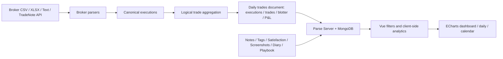

# TradeNote 竞品与开源架构研究

> - 研究目标：判断 TradeNote 已经解决好的问题，以及 Investment Tracker 作为 “AI Investment Decision Journal” 是否仍有值得验证的差异化空间。
> - 研究日期：2026-08-10
> - 研究对象：TradeNote `19.0.3`，Git commit [`56eb096`](https://github.com/Eleven-Trading/TradeNote/tree/56eb096631f95c1cdf5d9ef416e7d0115c56465e)（该仓库本次获取到的 `HEAD`）
> - 本地对比基准：`docs/PRODUCT_VISION_DRAFT.md`
> - 许可证边界：TradeNote 使用 GPL-3.0-or-later。本报告只总结产品与设计思想，不复制其实现代码。

## 0. 结论先行

**事实：** TradeNote 明确把自己定位为开源 Trading Journal，重点用户是关注数据隐私、简单性与灵活性的交易者。作者特别说明项目来自自己的日内交易需求；虽然支持 swing trade，但最常用、测试最充分的是日内股票交易。其产品结构被官方概括为 “Analyze + Reflect”：前者围绕交易绩效，后者围绕日记、截图、标签、满意度和 playbook。[README](https://github.com/Eleven-Trading/TradeNote/blob/56eb096631f95c1cdf5d9ef416e7d0115c56465e/README.md)；[Project Overview](https://tradenote.co/project-overview.html)

**判断：** TradeNote 与本项目的重叠主要集中在“交易数据进入系统之后，如何低成本整理、筛选和复盘”的通用层；对 Investment Tracker 愿景中最核心的“决策问责闭环”重叠有限。

- **高度重叠：** broker/CSV 导入、多账户筛选、execution 归并、P&L 与交易统计、标签、交易笔记、截图、日记、规则遵守的主观标记、按标签/时间/方向分析绩效。
- **部分重叠：** 用 `Satisfaction` 把“是否遵守交易规则”与 P&L 并列；按 tag/setup/mistake 分析长期表现；自动拉取价格数据生成价格图和 MFE；这些都触及“过程复盘”，但没有形成决策假设验证。
- **低重叠或暂未发现：** AI Counter-Thesis、时间边界严格的市场环境还原、AI 建议且由用户确认的交易原因、冻结原始投资逻辑、版本化修订、用后续事实验证原假设、Investment Outcome / Decision Quality 的正式双轨模型、长期 Decision Profile、中文和 A 股场景。

因此，**“笔记、标签、截图、规则满意度、模式分析”不能再被视为本项目的创新点**；仍值得验证的差异主要在：是否能把这些通用工具升级为可审计、可验证、面向普通投资者的 Decision Accountability Loop。

## 1. 研究方法、证据等级与状态定义

本报告检查了以下一手资料：

1. TradeNote 仓库的 README、`brokers/` 文档、统一 CSV template、`package.json` 和 Docker 配置；
2. 官方文档中的 Project Overview、Key Features、Importing Trades、Complementing Trades、Viewing Trades、Diary and Playbook、Brokers、Database、API Keys、Explanations；
3. 源码中的 Vue 页面、Parse/MongoDB schema、broker parser、导入与成交归并流程、过滤与 analytics、notes/tags/satisfaction/screenshots 持久化逻辑；
4. Investment Tracker 的 `docs/PRODUCT_VISION_DRAFT.md`。

本文状态含义：

- **已经存在 / TradeNote 已实现：** README、官方文档或源码有直接且实质相同的能力；
- **部分存在 / 部分重叠：** 有相邻能力，但缺少本项目愿景中的关键语义、结构或自动化；
- **没有发现 / 暂未发现：** 在上述资料与源码搜索中未发现实现证据；这不等于能证明任何历史版本或未公开服务绝对不存在；
- **目前无法判断：** 公开资料不足以可靠下结论。

除明确标注为事实的内容外，产品价值、成熟度和差异化判断均为基于公开实现的分析，不是用户需求验证结果。

## 2. 一、产品定位

### 2.1 核心目标用户

**事实：** 核心用户是自主交易者，尤其是日内交易者。官方描述反复强调帮助 trader 保存、发现和回忆交易模式，以提高一致性和盈利能力；文档进一步说明虽支持 intraday 和 swing trades，但项目源自日内股票交易需求，日内股票也是使用和测试最充分的场景。[README](https://github.com/Eleven-Trading/TradeNote/blob/56eb096631f95c1cdf5d9ef416e7d0115c56465e/README.md#L8-L12)；[Project Overview - Supported trades](https://tradenote.co/project-overview.html)

**判断：** 它主要面向有较多成交、需要复盘执行纪律和交易模式的主动交易者，而不是以资产配置、基本面假设和多年持有为中心的普通长期投资者。

### 2.2 主要解决的问题

**事实：** TradeNote 解决的是：把 broker executions 导入本地或自托管系统，归并为 trades，统计盈亏和交易行为，再用 dashboard、calendar、daily view、notes、tags、satisfaction、screenshots、diary 和 playbook 支持回顾。[Key Features](https://tradenote.co/key-features.html)；[Viewing Trades](https://tradenote.co/viewing-trades.html)

**判断：** 核心价值链可概括为：

```text
导入成交 → 归并交易 → 统计绩效 → 按模式筛选 → 交易者反思
```

它关注“我怎样交易、哪些模式赚钱、是否遵守规则”，而不是“当初的投资假设是什么、后来哪些事实证实或证伪了它”。

### 2.3 四个方向的相对权重

| 方向 | 判断 | 依据 |
| --- | --- | --- |
| Trading Performance | **主方向** | Dashboard 包含累计 P&L、win rate、profit factor、APPT/APPS、MFE、按日期/时间/持仓方向/tag/symbol 等分组的绩效分析。[Dashboard 源码](https://github.com/Eleven-Trading/TradeNote/blob/56eb096631f95c1cdf5d9ef416e7d0115c56465e/src/views/Dashboard.vue) |
| Trading Journal | **主方向** | notes、daily diary、playbook、satisfaction、screenshots、tags 均为正式功能。[Complementing Trades](https://tradenote.co/complementing-trades.html) |
| Portfolio Tracking | **非主方向** | 有 open positions、账户字段和多账户过滤，但没有发现资产配置、持仓权重、分红/现金流、基准比较等典型 portfolio 功能。 |
| Decision Quality | **少量触及，不是完整方向** | Satisfaction 可按交易规则将一笔交易或一天标为 good/bad，并与 P&L 分开展示；但没有结构化决策理由、假设、证据或验证流程。[Satisfaction 文档](https://tradenote.co/complementing-trades.html#adding-satisfaction) |

### 2.4 短线还是长期

**事实：** 支持日内和 swing trades；支持股票、期货、期权和外汇。官方同时明确表示日内股票最常用、测试最充分。Swing trade 的导入还需要从 flat position 开始，并对导入顺序有较强约束。[Importing Trades - Swing trades](https://tradenote.co/importing-trades.html#swing-trades)

**判断：** 产品实质上偏短线和波段交易。技术上能容纳跨日 open position，不等于已经服务长期投资研究与持仓决策。

## 3. 二、已有功能逐项核验

| # | 功能 | 状态 | 事实依据与边界 |
| --- | --- | --- | --- |
| 1 | 手工交易记录 | **没有发现** | 官方明确说明当前不支持、也暂无计划支持手工逐笔录入；变通方法是手工填写 template 后再导入，不能等同于原生手工记录。[Explanations - Manual Imports](https://tradenote.co/explanations.html#manual-imports) |
| 2 | CSV / broker import | **已经存在** | 官方 broker 文档、template 和多组 parser 均已实现；MT5 使用 XLSX，TradeStation 可粘贴文本，其余多数为 CSV。[Brokers](https://tradenote.co/brokers.html)；[`src/utils/brokers.js`](https://github.com/Eleven-Trading/TradeNote/blob/56eb096631f95c1cdf5d9ef416e7d0115c56465e/src/utils/brokers.js) |
| 3 | 多账户 | **已经存在** | execution/trade 保存 `account`；导入后更新用户的 `accounts`；过滤器支持选择多个账户。[`addTrades.js`](https://github.com/Eleven-Trading/TradeNote/blob/56eb096631f95c1cdf5d9ef416e7d0115c56465e/src/utils/addTrades.js#L394-L460)；[Viewing Trades - Filtering](https://tradenote.co/viewing-trades.html#filtering) |
| 4 | 交易笔记 | **已经存在** | 每笔 trade 可添加 note；另有按日期的 diary。[`daily.js`](https://github.com/Eleven-Trading/TradeNote/blob/56eb096631f95c1cdf5d9ef416e7d0115c56465e/src/utils/daily.js#L689-L765)；[Complementing Trades](https://tradenote.co/complementing-trades.html#adding-notes) |
| 5 | 买入/卖出理由 | **部分存在** | 自由文本 note/diary 可以写理由，但没有发现 `reason`、thesis、source、confidence、exit condition 等结构化字段，也没有买入理由与卖出理由的正式区分。 |
| 6 | tags | **已经存在** | 支持 trade/day tags、tag groups、颜色、设置页组织、过滤和按 tag 分析绩效。[`daily.js`](https://github.com/Eleven-Trading/TradeNote/blob/56eb096631f95c1cdf5d9ef416e7d0115c56465e/src/utils/daily.js#L203-L287)；[Complementing Trades](https://tradenote.co/complementing-trades.html#adding-tags) |
| 7 | strategy / setup | **部分存在** | tags 可标记 patterns/setups/mistakes；有 yearly playbook。交易对象的 `strategy` 实际只表示 `long`/`short`，没有发现 trade 到结构化 strategy/playbook 的强关联。[Diary and Playbook](https://tradenote.co/diary-playbook.html)；[`addTrades.js`](https://github.com/Eleven-Trading/TradeNote/blob/56eb096631f95c1cdf5d9ef416e7d0115c56465e/src/utils/addTrades.js#L414-L428) |
| 8 | 情绪记录 | **部分存在** | diary 文档明确允许记录 feelings 和 trader psychology，但没有发现每笔交易的结构化 emotion 类型、强度、前后状态或情绪分析。[Diary](https://tradenote.co/diary-playbook.html#diary) |
| 9 | 截图/附件 | **部分存在** | 截图上传、与交易或日期关联、标注和集中查看已经存在；没有发现任意文档/文件附件模型。[`screenshots.js`](https://github.com/Eleven-Trading/TradeNote/blob/56eb096631f95c1cdf5d9ef416e7d0115c56465e/src/utils/screenshots.js)；[Complementing Trades](https://tradenote.co/complementing-trades.html#adding-screenshot) |
| 10 | 交易统计 | **已经存在** | trades/executions、win rate、profit factor、APPT/APPS、时段、duration、方向、tag、symbol 等多维统计较完整。[Viewing Trades](https://tradenote.co/viewing-trades.html#dashboard-view) |
| 11 | 盈亏分析 | **已经存在** | gross/net P&L、累计 P&L、胜负、平均/最大单股盈亏、P/L ratio、MFE 与 excursions 均有实现。[`trades.js`](https://github.com/Eleven-Trading/TradeNote/blob/56eb096631f95c1cdf5d9ef416e7d0115c56465e/src/utils/trades.js#L356-L823) |
| 12 | 月度/年度复盘 | **部分存在** | 有月历、this year 等范围过滤，以及 daily/weekly/monthly 聚合；playbook 可按年度记录。但没有发现专门的月度/年度复盘工作流、固定快照或自动生成叙事报告。[Viewing Trades](https://tradenote.co/viewing-trades.html#filtering) |
| 13 | AI 功能 | **没有发现** | 依赖清单、页面、后端路由和源码关键词检查均未发现 LLM/AI 集成；Polygon/Databento 是市场数据服务，不是 AI。[`package.json`](https://github.com/Eleven-Trading/TradeNote/blob/56eb096631f95c1cdf5d9ef416e7d0115c56465e/package.json) |
| 14 | 自动市场环境还原 | **没有发现** | 能自动获取价格图和 MFE，但没有发现按交易当时的信息边界还原新闻、公告、估值、宏观、行业或市场情绪。价格图不能等同于 Context Reconstruction。[API Keys - Market Data](https://tradenote.co/api-keys.html#market-data) |
| 15 | AI 自动推测交易原因 | **没有发现** | 没有 AI，也没有候选原因及用户确认的模型。 |
| 16 | AI 反方观点 | **没有发现** | 没有发现 counter-thesis、contrarian review 或类似实现。 |
| 17 | 冻结原始投资逻辑 | **没有发现** | notes/tags/satisfaction/screenshots 可原地更新；没有 revision、snapshot、append-only decision 或 freeze 状态。Parse 的 `createdAt/updatedAt` 不是历史版本。[`daily.js`](https://github.com/Eleven-Trading/TradeNote/blob/56eb096631f95c1cdf5d9ef416e7d0115c56465e/src/utils/daily.js#L519-L765) |
| 18 | 后续通过真实事实验证原假设 | **没有发现** | MFE、价格走势和实际 P&L 属于结果数据，但系统没有原假设、验证指标、事实证据和 supported/refuted/unclear 状态。 |
| 19 | 区分 Investment Outcome 和 Decision Quality | **部分存在** | P&L/win rate 与 Satisfaction 分开展示；Satisfaction 可根据是否遵守交易规则标好/坏。这已经否定“TradeNote 完全只看盈亏”的说法，但仍只是人工二元标记，不是本愿景中的假设质量与事实验证模型。[Key Features](https://tradenote.co/key-features.html)；[`charts.js`](https://github.com/Eleven-Trading/TradeNote/blob/56eb096631f95c1cdf5d9ef416e7d0115c56465e/src/utils/charts.js#L32-L63) |
| 20 | 长期 Decision Profile / 行为画像 | **部分存在** | 可按星期、入场时段、持仓时长、交易次数、execution 数、long/short、tag/setup/mistake、symbol、entry price 分析绩效，能帮助用户观察长期模式；但没有形成跨记录的解释性画像，也没有理由、假设、偏差、证据质量或“运气 vs 逻辑”的模型。[Viewing Trades](https://tradenote.co/viewing-trades.html#dashboard-view) |

## 4. 三、数据模型

### 4.1 Trade / Transaction 如何表示

**事实：** MongoDB/Parse 中名为 `trades` 的 class 不是“一条 trade 一条 document”，而是一个**按交易日分桶的文档**。主要字段包括：

- `date`、`dateUnix`、`openPositions`；
- `executions`: 当日原始/规范化 execution 对象数组；
- `trades`: 从 executions 归并出的逻辑交易数组；
- `blotter`: 按 symbol 汇总的派生对象；
- `pAndL`: 当日派生盈亏对象。

Schema 依据见 [`requiredClasses.json`](https://github.com/Eleven-Trading/TradeNote/blob/56eb096631f95c1cdf5d9ef416e7d0115c56465e/requiredClasses.json#L76-L207)，写入流程见 [`addTrades.js`](https://github.com/Eleven-Trading/TradeNote/blob/56eb096631f95c1cdf5d9ef416e7d0115c56465e/src/utils/addTrades.js#L1988-L2053)。

规范化 execution 是普通嵌套对象，包含 account、broker、trade/settlement date、currency、type、side、symbol、quantity、price、execution time、commission/fees、gross/net proceeds、note 和生成的 execution id。聚合后的 trade 包含 account、broker、long/short、symbol、entry/exit time and price、buy/sell quantity、费用、gross/net P&L、状态、execution id 列表和 open position 状态。[execution 构建](https://github.com/Eleven-Trading/TradeNote/blob/56eb096631f95c1cdf5d9ef416e7d0115c56465e/src/utils/addTrades.js#L378-L523)；[trade 构建](https://github.com/Eleven-Trading/TradeNote/blob/56eb096631f95c1cdf5d9ef416e7d0115c56465e/src/utils/addTrades.js#L934-L1462)

**判断：** 这是 `Execution → Logical Trade → Daily Aggregate` 三层结构，但 execution 和 logical trade 都嵌套在 daily document 中，不是独立一等实体。

### 4.2 客观事实与主观日志是否分开

**事实：** 分开得比较明确：

- 客观及派生交易数据位于 `trades`；
- `notes`、`tags`、`satisfactions`、`screenshots` 是独立 class；
- `diaries`、`playbooks` 也是独立 class；
- 主观对象通常通过字符串 `tradeId` 和 `dateUnix` 关联 trade 或交易日，而不是数据库 pointer。

完整 class 列表见 [`requiredClasses.json`](https://github.com/Eleven-Trading/TradeNote/blob/56eb096631f95c1cdf5d9ef416e7d0115c56465e/requiredClasses.json)。管理导入页面还明确提示：删除 import 会删除 excursions，但不会删除 screenshots、tags、notes 和 satisfactions。[`Imports.vue`](https://github.com/Eleven-Trading/TradeNote/blob/56eb096631f95c1cdf5d9ef416e7d0115c56465e/src/views/Imports.vue#L80-L86)

**判断：** “客观交易事实”和“用户补充内容”解耦是值得借鉴的设计思想；但用字符串弱关联会产生孤儿数据和重导入后的关联脆弱性。本项目应借鉴边界，不应照搬链接方式。

### 4.3 多个 entry / exit

**事实：** broker/template 要求“一行一个 execution”。导入后先按时间排序，再按 symbol、asset type、long/short 和交易日起组。每个逻辑 trade 保存 execution id 数组；系统累计 buy/sell quantity，数量相等时关闭 position，因此能表达多次加仓、分批退出和跨日 open position。[Template 说明](https://tradenote.co/brokers.html#template)；[`createTrades`](https://github.com/Eleven-Trading/TradeNote/blob/56eb096631f95c1cdf5d9ef416e7d0115c56465e/src/utils/addTrades.js#L934-L1462)

**边界：** 文档说明 partial close 的 P&L 计在最终 closing day；swing trade 对首次导入是否从 flat position 开始、导入顺序和删除/重导入非常敏感。[Importing Trades](https://tradenote.co/importing-trades.html#swing-trades)

### 4.4 账户

**事实：** account 是 execution/trade 内的字符串；用户对象维护一个 `accounts` array 用于过滤。没有独立 `Account` class，也没有发现账户级 base currency、broker connection、tax lot、cash ledger 或生命周期模型。[`requiredClasses.json`](https://github.com/Eleven-Trading/TradeNote/blob/56eb096631f95c1cdf5d9ef416e7d0115c56465e/requiredClasses.json#L1-L74)；[`addTrades.js`](https://github.com/Eleven-Trading/TradeNote/blob/56eb096631f95c1cdf5d9ef416e7d0115c56465e/src/utils/addTrades.js#L2086-L2159)

**判断：** 足够支持“按多个交易账户过滤”，不等于完整 portfolio account 模型。

### 4.5 broker import 与统一内部模型

**事实：** 每个 broker parser 把外部 CSV/XLSX/text 转换成与 `brokers/Template.csv` 相同的字段集合，写入共享的 `tradesData`，后续统一构建 executions 和 trades。例如 IBKR parser 映射 account、asset class、buy/sell code、underlying symbol、quantity、price、commission 和 proceeds。[Template](https://github.com/Eleven-Trading/TradeNote/blob/56eb096631f95c1cdf5d9ef416e7d0115c56465e/brokers/Template.csv)；[IBKR parser](https://github.com/Eleven-Trading/TradeNote/blob/56eb096631f95c1cdf5d9ef416e7d0115c56465e/src/utils/brokers.js#L621-L715)

### 4.6 tags / strategy / notes

- Tags 是独立 class；用户对象保存可用 tag groups，trade/day 的 tag 记录只保存 tag id 数组。
- Notes 是独立 class，每个 `tradeId` 对应自由文本 note，并原地更新。
- Playbook 是按日期保存的富文本字符串，独立于具体 trade。
- `strategy` 字段只代表 long/short。Setup/mistake 主要通过 tags 表达。

### 4.7 历史修改

**事实：** 没有发现 revision、event log、audit history 或 immutable snapshot。Parse 自动保存 `createdAt/updatedAt`，但 notes、tags、satisfaction、screenshots 和 open-position trade 会更新现有对象；import 也可以删除后重建。

**判断：** TradeNote 的数据模型适合“当前视图的交易日志”，不适合直接承担“冻结决策并证明某时刻用户写了什么”的审计语义。

### 4.8 值得借鉴的模型思想

1. **Execution 与 logical trade 分层。** Broker execution 是事实输入，trade 是按持仓方向和数量归并出的分析对象。
2. **主观 enrichments 与交易事实分离。** Notes/tags/satisfaction/screenshots 不嵌入原始 execution，便于独立演进。
3. **原始层与派生 analytics 分开命名。** executions、trades、blotter、pAndL 的层次有利于解释数据从哪里来。
4. **一笔 trade 保留所有 execution 引用。** 多次 entry/exit 不应被压平为单一均价而丢失明细。
5. **账户、时区、币种必须在 canonical transaction 早期进入模型。** 这些是导入正确性的基础。

需要改进而非照搬之处：daily document 大数组、字符串弱关联、日期级去重、缺少独立 import batch/provenance、缺少稳定 broker execution id、缺少版本化 decision 模型。

## 5. 四、导入体系

### 5.1 支持不同 broker 的方式

**事实：** 源码中的 broker 配置包含 Template、TradeZero、Interactive Brokers、TD Ameritrade、TradeStation、Tradovate、MetaTrader 5、HeldenTrader、Rithmic、FundTraders、NinjaTrader、TastyTrade、TopstepX。官方 broker 页面列出其中 11 个 broker/platform 和 template，但没有列出源码已有的 TastyTrade，说明文档与源码存在轻微不同步，不能仅凭 parser 名称推断生产成熟度。[broker 配置](https://github.com/Eleven-Trading/TradeNote/blob/56eb096631f95c1cdf5d9ef416e7d0115c56465e/src/stores/globals.js#L3196-L3289)；[官方 Brokers](https://tradenote.co/brokers.html)

不同来源的读取方式包括：

- CSV/text：Papa Parse；
- MT5 XLSX：SheetJS；
- TradeStation：粘贴文本；
- HTTP API：实验性的 `POST /api/trades`，接收 execution 数组及 `selectedBroker`；
- Polygon/Databento：用于价格图和 MFE，不是 broker transaction sync。

**重要边界：** `POST /api/trades` 是 TradeNote 暴露的导入入口，需要外部调用方先准备好 executions；它不是 TradeNote 主动登录 broker 后同步账户。源码虽然为 IBKR 保存了 auto-sync 配置元数据，但 Imports 页的 Auto-Sync tabs 被注释，页面内容仍标为 “Work in progress”，因此本报告不把它计为已经实现的 broker API sync。[TradeNote API](https://tradenote.co/api-keys.html#tradenote-api)；[`Imports.vue`](https://github.com/Eleven-Trading/TradeNote/blob/56eb096631f95c1cdf5d9ef416e7d0115c56465e/src/views/Imports.vue#L42-L57)

### 5.2 是否存在统一 importer interface

**事实：** 存在**隐式约定**，不存在清晰的正式 interface：

- `useImportTrades` 根据 `selectedBroker` 用一组 `if` 分派到不同 parser；
- 每个 parser 接收原始内容并修改共享的全局 `tradesData`；
- parser 成功后共同进入 `createTempExecutions → createExecutions → createTrades → filterExisting → createBlotter/PnL → upload`。

依据见 [`addTrades.js`](https://github.com/Eleven-Trading/TradeNote/blob/56eb096631f95c1cdf5d9ef416e7d0115c56465e/src/utils/addTrades.js#L82-L375)。

**判断：** TradeNote 已证明“broker adapter → canonical execution → shared aggregation pipeline”这个架构方向有效；但共享可变全局状态、条件分派和缺少统一错误/警告返回值，不是本项目应直接模仿的 importer interface。

### 5.3 统一内部模型

统一入口是 Template 的 execution schema：Account、trade/settlement date、Currency、Type、Side、Symbol、Qty、Price、Exec Time、Commission/fees、Gross/Net Proceeds 等。各 parser 负责：

1. 识别 source columns；
2. 统一日期、时间和 side；
3. 推导 asset type、underlying symbol、费用和 proceeds；
4. 写入 canonical `tradesData`；
5. 共享流程再生成内部 execution id 和 logical trade。

### 5.4 重复导入

**事实：** 去重粒度是**交易日**，不是 broker execution。系统先获取已存在 trade documents 的 `dateUnix`；新导入中若某天已经存在，就把该整天 executions/trades 从待写入集合移除。官方文档明确说明同一天只能导入一次；若要补交易，必须删除该天 import 再完整重导，并可能影响 swing trades。[`filterExisting`](https://github.com/Eleven-Trading/TradeNote/blob/56eb096631f95c1cdf5d9ef416e7d0115c56465e/src/utils/addTrades.js#L1515-L1558)；[Importing Trades](https://tradenote.co/importing-trades.html#instructions)

**判断：** 这是一种简单、可解释的幂等保护，但代价很高：无法安全增量补录同日成交，无法区分同日重复 execution 与新 execution，也把跨日持仓正确性绑定在导入顺序上。它不适合未来同时支持 CSV、OCR 和 broker API 的系统。

### 5.5 对 Investment Tracker 未来导入方式的启示

建议借鉴“多 adapter、单 canonical model、共享后处理”，但将其升级为：

```text
CSV / OCR / Broker API
        ↓
Source Adapter（只负责提取）
        ↓
Canonical Transaction + ImportIssue
        ↓
Validation / Normalization / Stable Fingerprint
        ↓
ImportBatch + Provenance + Dedup Result
        ↓
Position / Decision Linking / Analytics
```

应优先保留的通用字段和元数据：source type、broker/account、source record id、raw row reference、occurred_at、timezone、currency、asset identity、side、quantity、price、fees、content hash、import batch、parser version、warnings、人工修正记录。

- **CSV：** adapter 显式返回 `records + issues`，不要修改全局数组；保留原始行和列映射版本。
- **OCR：** 与 CSV 共用 canonical transaction，但额外保存截图、OCR 文本、字段置信度和用户确认状态；低置信度不能静默写成事实。
- **Broker API：** 优先使用 broker execution id 做幂等键，并保存 cursor/sync window；不能退化成“当天已经存在就全部跳过”。
- **跨来源重复：** 需要 broker id、source id、字段 fingerprint 和用户确认的分层策略；同一成交可能先由 OCR 录入、后由 CSV/API 到达。

## 6. 五、架构

### 6.1 总体组织



### 6.2 前端

**事实：** Vue 3 + Vite + Vue Router；Pinia 被安装和初始化，但大量业务状态集中在 `src/stores/globals.js` 的 Vue reactive/ref 全局变量。页面包括 Dashboard、Calendar、Daily、Diary、Screenshots、Playbook、Add Trades、Imports、Settings 等。[`package.json`](https://github.com/Eleven-Trading/TradeNote/blob/56eb096631f95c1cdf5d9ef416e7d0115c56465e/package.json)；[`router/index.js`](https://github.com/Eleven-Trading/TradeNote/blob/56eb096631f95c1cdf5d9ef416e7d0115c56465e/src/router/index.js)

### 6.3 后端与 API

**事实：** `index.mjs` 在同一 Node 进程中启动 Express 和 Parse Server。前端大量使用 Parse JS SDK 直接查询/保存对象；Express 另提供注册配置、Stripe、版本、实验性 `POST /api/trades`、Databento proxy 等少量端点。生产环境由 Express 提供构建后的 SPA 静态文件。[`index.mjs`](https://github.com/Eleven-Trading/TradeNote/blob/56eb096631f95c1cdf5d9ef416e7d0115c56465e/index.mjs)

### 6.4 数据库

**事实：** MongoDB + Parse schema，Docker Compose 默认启动 TradeNote app 和 MongoDB 两个容器，并使用 volume 持久化。[Database](https://tradenote.co/database.html)；[`docker-compose.yml`](https://github.com/Eleven-Trading/TradeNote/blob/56eb096631f95c1cdf5d9ef416e7d0115c56465e/docker-compose.yml)

### 6.5 Importer 与 analytics

**事实：** Importer 主要位于前端工具模块 `addTrades.js` / `brokers.js`，实验性 server API 复用同一套函数。Analytics 主要在浏览器端从已加载 trades 计算 totals、分组和 profit analysis，再用 ECharts 渲染；部分日级 blotter/P&L 在导入时预计算并持久化。[`trades.js`](https://github.com/Eleven-Trading/TradeNote/blob/56eb096631f95c1cdf5d9ef416e7d0115c56465e/src/utils/trades.js)；[`charts.js`](https://github.com/Eleven-Trading/TradeNote/blob/56eb096631f95c1cdf5d9ef416e7d0115c56465e/src/utils/charts.js)

### 6.6 可独立借鉴的架构模式

1. **输入 adapter 与后续 trade aggregation 分层；**
2. **execution 明细、logical trade、日级 aggregate 三层可追溯；**
3. **客观交易数据与主观 enrichments 分 collection；**
4. **相同过滤维度驱动 dashboard、daily、calendar 多个视图；**
5. **自托管 app + database 的低门槛 Docker 部署；**
6. **市场数据 provider 与 broker transaction provider 分开。**

不建议照搬的实现：共享全局可变状态、parser 条件链、日期级去重、字符串弱关联、导入时将大量派生结果写回同一 daily document、缺少 version/provenance/audit 模型。

## 7. 六、与 Investment Tracker Product Vision Draft 比较

| 待验证差异化假设 | 对 TradeNote 的判断 | 事实与分析 |
| --- | --- | --- |
| 1. 从 Trading Performance 转向 Decision Quality | **部分重叠** | TradeNote 主体仍是 P&L、胜率、profit factor、MFE 和按维度分组的绩效分析；Satisfaction 允许用户按交易规则标 good/bad，已经触及 process quality，但没有决策假设、证据和验证。 |
| 2. 普通投资者而不是专业短线交易者 | **暂未发现** | TradeNote 明确来自 day trader 需求，intraday stock 最成熟；支持 swing 不等于服务长期普通投资者。没有发现 ETF 长期持有、基本面 thesis、资产配置或 A 股散户导向。 |
| 3. AI Counter-Thesis | **暂未发现** | 没有发现 AI/LLM 集成或反方观点工作流。 |
| 4. Investment Outcome 与 Decision Quality 分离 | **部分重叠** | P&L 与 Satisfaction 分开展示，是最接近的已有能力；但 Satisfaction 是手工二元规则遵守标记，并未验证“赚钱但假设错误”或“亏钱但假设正确”。 |
| 5. Freeze Decision + 后续事实验证 | **暂未发现** | Notes 等可原地更新，没有 revision/snapshot；价格和 MFE 是结果，不是对 frozen thesis 的事实验证。 |
| 6. Decision Profile | **部分重叠** | 多维长期绩效与 tags/setup/mistake 分析能揭示行为模式；但没有形成解释性 profile，也没有对原因、偏差、假设命中率和运气进行建模。 |
| 7. 降低投资复盘操作成本 | **部分重叠** | Broker import、统一 template、自动 P&L/MFE、filters、截图与日记明显降低了交易日志成本；但决策理由、市场背景和事后验证仍需用户手工完成，且 TradeNote 明确不支持原生手工逐笔录入。 |
| 8. 中文 / A 股投资场景 | **暂未发现** | UI 与文档为英文，broker 与费用模型主要面向海外股票/期货/期权/外汇；没有发现中文本地化、A 股券商、交易日历、T+1、涨跌停、印花税、复权/分红送转等专门支持。 |

### 7.1 重叠程度的诚实判断

**判断：** 如果把本项目描述为“支持导入、notes、tags、screenshots、journal、P&L、按模式分析”，与 TradeNote 的重叠很高，难以构成差异化；如果把本项目严格限定为“围绕一项投资判断，冻结当时可知信息和原始假设，后来用事实验证，并长期评估 decision quality”，当前公开版 TradeNote 只在 satisfaction 和 pattern analytics 上有部分重叠。

### 7.2 TradeNote 已经触及、不能再声称完全空白的点

1. **结果与过程不必相同。** Satisfaction 可按是否遵守规则独立于 P&L 标记。
2. **长期行为模式分析。** 它已经按时段、持有时间、交易频次、方向、setup/tag/mistake 等分析表现。
3. **结构化复盘成本降低。** Broker import、价格图、MFE、截图标注、日历和 filters 已显著自动化。
4. **Playbook + setup/mistake taxonomy。** 交易者可以沉淀规则、最佳实践和模式分类。

这些能力与完整 Decision Quality 系统仍不同，但不能把“过程复盘”“行为模式”“降低日志成本”本身宣传成从未有人做过。

## 8. 七、哪些东西不应该重复造轮子

以下是 TradeNote 已经证明有通用价值、未来不必从产品概念层面重新发明的能力。这里的“借鉴”指学习需求和架构模式，不指复制 GPL 源码。

1. **Canonical execution contract。** 不同 broker 先映射到统一成交事实，再做下游处理。
2. **Execution 与 trade 分离。** 一笔逻辑交易可以包含多次 entry/exit executions。
3. **Broker adapter registry。** 每个来源独立解析；新增来源不应修改核心交易计算语义。
4. **导入前验证与明确错误。** 日期、方向、asset type、费用、排序和 timezone 都需要校验与可操作提示。
5. **多账户与组合过滤。** date range、account、long/short、gross/net、tag、time aggregation 是成熟的基础维度。
6. **Tags + tag groups。** Setup、mistake、策略和观察分类可共用通用标签基础设施。
7. **Trade/day 两级 enrichments。** Notes、tags、satisfaction、screenshots 既可挂在单笔 trade，也可挂在某一天。
8. **截图与标注。** 对交易图表的上传、关联、标注和集中回看是成熟的 journal 能力。
9. **Dashboard / Daily / Calendar 三种视角。** 总览、逐日细节和日历热力是稳定的信息架构。
10. **常规绩效指标。** P&L、win rate、profit factor、平均盈亏、fees、MFE/MAE、按 tag/symbol/time/duration 分组没有必要重新定义概念。
11. **Import batch 管理。** 用户需要看到、删除和重做某次导入；但本项目应使用更细粒度、更安全的依赖与去重模型。
12. **隐私友好的自托管路径。** App + database 的容器化部署是个人财务数据产品的重要选项。

TradeNote 同时证明了几个不能照搬的教训：不要只按日期去重，不要让 subjective enrichments 依赖易变化的字符串 id，不要把所有 parser 写成共享全局状态的条件链，也不要把“删除整日再导入”当成日常修正机制。

## 9. 八、对 v0.2.0 核心假设的启示

本节不设计完整 v0.2.0，只讨论 TradeNote 对以下假设的影响：

> 普通投资者需要的不是另一个交易日志，而是一个降低复盘成本并验证投资决策质量的系统。

### 9.1 TradeNote 支持了假设的哪些部分

1. **交易日志确实需要“导入 + 反思”两部分。** TradeNote 的 Analyze/Reflect 结构说明，只保存成交不足以形成复盘产品。
2. **数据录入成本是关键摩擦。** 多 broker parser、template、实验性 API 和自动 MFE 都围绕减少手工工作展开。
3. **用户关心的不只有盈亏。** Satisfaction、diary、playbook、setup/mistake tags 说明规则、心理和过程已经是交易日志的正式需求。
4. **客观事实与主观补充应分开。** TradeNote 的 collection 划分为 Decision Journal 的事实层和判断层提供了正面参考。
5. **现有产品重心仍偏 performance。** TradeNote 最成熟的是短线绩效与执行效率，这为不同于 Trading Performance 的定位留下了空间。

### 9.2 TradeNote 削弱了假设的哪些部分

1. **“降低复盘成本”本身不够差异化。** 导入、过滤、截图、日记、自动行情图和 MFE 已经在降低成本。
2. **“过程质量不同于盈亏”也不是完全新概念。** Satisfaction 已经允许用户根据是否遵守规则独立打分。
3. **“行为画像”不是空白。** 按 setup/mistake/tag、时段、duration、频次和方向统计长期表现，已经构成基础行为分析。
4. **通用 trading journal 功能的完成度门槛较高。** 如果本项目先花大量时间补齐所有 broker、图表、指标和截图能力，容易进入 TradeNote 已经很深的赛道，而尚未验证自身核心价值。
5. **自动化不自动等于低维护。** TradeNote 的 broker-specific parser、格式清理和 swing trade 边界表明，导入覆盖面会带来持续支持成本。

### 9.3 仍值得继续验证的问题

#### 用户与场景

1. 普通长期/波段投资者的复盘痛点是否足够高频、足够强，愿意形成习惯？
2. 他们真正缺的是记录工具、提醒机制、历史信息检索，还是有人帮助挑战和验证假设？
3. ETF、个股、长线、波段用户是否需要同一种 Decision Journal，还是决策对象和验证周期完全不同？

#### Decision Quality

4. “好决策”如何定义和评分，才能避免系统只生成看似专业的事后解释？
5. 哪些假设可以被客观验证，哪些只能标记为 uncertain？谁决定验证标准和时间窗口？
6. 如何区分 thesis 正确、timing 错误、position sizing 错误、执行错误和纯粹运气？
7. Satisfaction 这种轻量二元标记是否已经足够，用户是否真的愿意使用更严格的假设/证据流程？

#### AI 价值与风险

8. AI 建议交易原因会降低记录成本，还是会诱导用户接受事后包装的理由？`USER_WRITTEN` 与 `AI_SUGGESTED_USER_CONFIRMED` 的来源标记是否足以控制风险？
9. AI Counter-Thesis 是否能改变决策或提高复盘质量，还是会被视为泛泛风险提示和额外摩擦？
10. 时间边界严格的 Context Reconstruction 能否在数据许可、准确性和成本可控的前提下实现？

#### Freeze 与长期画像

11. 用户是否接受冻结原始判断？如何区分纠正事实错误与篡改历史逻辑？
12. 形成有用 Decision Profile 需要多少条记录、多久时间和怎样的标签一致性？小样本时如何避免伪洞察？
13. 画像最终能否给用户可行动的改进建议，而不仅是另一组统计图？

#### 中文与 A 股

14. 主流 A 股券商导出格式、对账单、成交截图和官方只读 API 的真实可得性如何？
15. T+1、100 股一手、涨跌停、停牌、复权、分红送转、印花税、ETF 规则等，哪些会实质改变 transaction/position/outcome 模型？
16. 中文公告、财报、政策与新闻的 point-in-time 数据能否可靠还原，如何防止使用未来信息？
17. 中文/A 股是否只是本地化优势，还是能形成独特的决策验证数据和工作流优势？

## 10. 最终判断

**A. TradeNote 和我们的想法重叠多少？**

通用交易日志与绩效层高度重叠；Decision Accountability Loop 层低到中度重叠。最接近的已有能力是 Satisfaction、setup/mistake tags、playbook 和长期分组分析，但它们没有把“原始假设—反方观点—冻结—事实验证—决策画像”连成闭环。

**B. 最可能有价值的差异是什么？**

不是再增加更多统计图，而是验证四个互相依赖的能力：面向普通投资者的低摩擦理由确认；有时间边界的 context；冻结且可修订但不可静默覆盖的 decision record；独立于盈亏的事实验证与长期 Decision Profile。中文/A 股可能是场景优势，但尚不能仅凭 TradeNote 缺席就认定有需求。

**C. 哪些原以为有创新性的东西其实已经有人做了？**

过程不等于盈亏的轻量表达、按交易规则标好坏、setup/mistake taxonomy、日记与年度 playbook、按长期行为维度分析表现、自动导入后生成图表/MFE、减少复盘录入成本，都已被 TradeNote 部分或较完整实现。

**D. 接下来最值得研究什么？**

应优先研究“用户是否愿意为严格的假设验证付出额外一步”，以及 AI 是否真能降低这一步的成本而不制造事后合理化。技术上最先需要验证的是 point-in-time context 的数据可得性与 decision/outcome 双轨模型；市场上最先需要验证的是普通投资者、尤其中文/A 股用户是否把这个问题视为高价值痛点。
