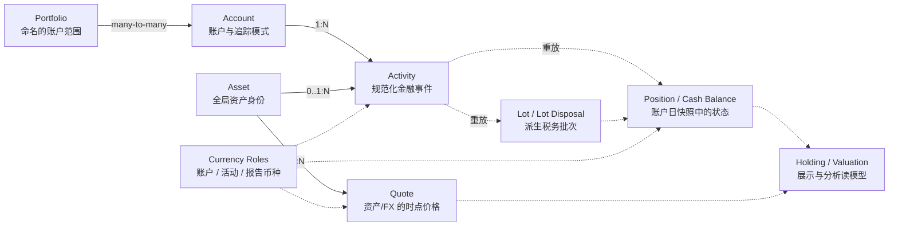
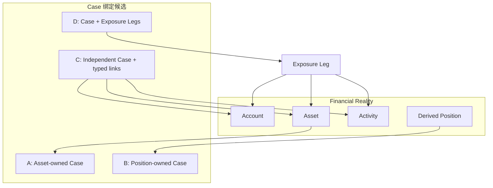
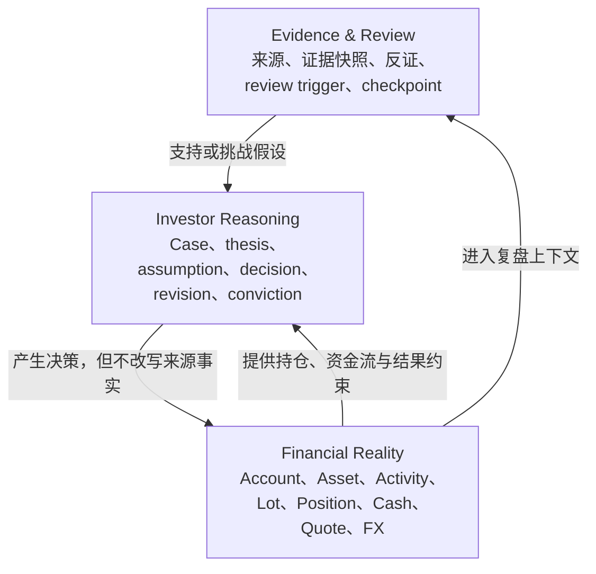

# Wealthfolio 开源项目研究：为长期投资决策系统补齐 Financial Reality 层

> 研究对象：Wealthfolio 官方仓库与官方文档
>
> 仓库基准：`09c7ca4b985becdd8e35f1d57290ad8d05bd4454`（2026-08-10）
>
> 研究日期：2026-08-11
>
> 范围约束：本报告只研究 Wealthfolio；不提出数据库迁移，不修改现有产品定义，也不替后续架构讨论做最终选型。

## 0. 研究方法与证据标记

本轮延续本项目第一轮研究形成的前提：`investment-tracker` 的候选方向不是“另一个收益看板”，而是面向长期投资者的 Investment Thesis Monitor + Decision Journal。Wealthfolio 的价值在于说明账户、资产、活动、持仓、现金、价格与多币种这些“金融现实”应如何形成可靠账本；它并不直接回答投资者当时为什么做、哪些假设待验证、何时复盘。

为了避免把源码观察、合理推断和产品判断混在一起，全文采用三种标签：

- **事实**：由官方 README、官方文档、当前 Schema 或源码直接支持。
- **源码推断**：不是文档承诺，但可由多个实现细节稳定推得；仍需在真正设计时用测试验证。
- **对本项目的判断**：结合 `PRODUCT_VISION_DRAFT.md` 与 TradeNote 研究得出的产品/领域判断，不声称是 Wealthfolio 的结论。

本报告只做结构与行为摘要，没有复制大段 AGPL 源码。源码链接全部固定到上述提交，避免后续主分支漂移。

## 1. 定位：Wealthfolio 是什么，不是什么

### 1.1 产品定位

**事实**：Wealthfolio 将自己定位为开源、隐私优先的个人财富管理与投资组合跟踪工具。当前产品覆盖四个相邻领域：

1. Investments：持仓、配置、活动、收益、收入；
2. Net Worth：投资之外的资产与负债；
3. Spending：账户交易与支出洞察；
4. Planning：目标与长期情景规划。

核心数据可保存在用户本地 SQLite 文件中，桌面端无需注册账号；行情、更新以及用户主动启用的 Connect 等能力会访问外部服务。官方 README 和 Introduction 明确强调持仓、TWR/MWR、多币种、收入与目标，而不是交易执行复盘或投资论证。[README（固定提交）][src-readme] [Introduction][doc-introduction]

**事实**：Wealthfolio 不是以日内交易者为中心的 Trading Journal。`Activity` 虽然记录买卖、费用、股息等事件，但没有“入场 setup、执行纪律、满意度”等 TradeNote 风格的交易复盘主模型。

**事实**：Wealthfolio 也不是 Investment Research System。对当前仓库中 `thesis`、`conviction`、`investment case`、投资理由等概念的检索，没有发现与资产/活动/持仓相连的结构化投资论证生命周期。活动和资产有通用 `notes`，但它们不是可版本化的 thesis、assumption、evidence、review condition 或 decision freeze。[Activity 模型][src-activity-model] [Asset 模型][src-asset-model]

**对本项目的判断**：可将 Wealthfolio 概括为一个成熟的 **Financial Reality engine**：它擅长回答“我在哪个账户、以什么币种、持有什么、发生过什么、现在值多少、收益如何”；它基本不回答“当时为什么持有、论点是否仍成立、哪些证据改变了判断”。这恰好使它成为本项目第二轮研究的互补样本。

### 1.2 它优先解决的问题

**事实**：从数据模型与服务重心看，优先级大致为：

1. 将账户、资产标识、活动和直接持仓快照规范化；
2. 从活动重放出现金、税务批次、持仓和每日估值；
3. 处理账户范围/组合范围、外部现金流、内部转账和多币种；
4. 支持 CSV、手工录入和可选券商同步进入同一个 canonical ledger；
5. 在该账本上计算净值、配置、收入、TWR/MWR 与目标进度。

**对本项目的判断**：Wealthfolio 证明“长期投资”并不等于只存一张当前持仓表。长期可信性来自可追溯活动、账户边界、历史价格/汇率、派生快照和可重建读模型的组合。

## 2. 核心领域对象与关系

### 2.1 总体关系图

下图是对当前模型的概念化摘要；实线表示事实账本或持久关系，虚线表示派生/物化读模型：

依据：[Account 模型][src-account-model]、[Portfolio 模型][src-portfolio-model]、[Activity 模型][src-activity-model]、[Position 模型][src-position-model]、[Holding 模型][src-holding-model]、[Quote 模型][src-quote-model]、[当前 SQLite Schema][src-schema]。

### 2.2 对象清单：事实、持久化与派生边界

| 对象 | 关键字段/身份 | 是否持久化 | 事实还是派生 | 主要关系与说明 |
|---|---|---:|---|---|
| `Account` | `id`、name、type、group、currency、active/archive、tracking mode、provider、provider account id | 是 | 事实 | `Activity` 和持仓快照的账本边界；券商只是 provider/platform，账户才是持仓与现金的归属单位。 |
| `Asset` | opaque UUID、kind、instrument type、symbol、MIC、quote currency、quote mode、instrument key、provider config | 是 | 事实 | 全局共享身份；同一资产可被多个账户活动引用，不与某一个账户绑定。 |
| `Activity` | id、account/asset、type/status/date、quantity/price/amount/fee/tax/currency/fx、source/idempotency | 是 | 事实 | Transaction 模式的核心 ledger event；买卖、收入、现金流、转账和部分公司行动都进入此表。 |
| `Portfolio` | id、name、description、sort order；关联若干 account ids | 是 | 事实（范围定义） | 是保存的报告范围，不是另一层资金账本；账户与 Portfolio 为多对多。 |
| `Quote` / Price | asset、timestamp、OHLC/adjusted close、volume、currency、source | 是 | 外部/人工时点事实 | 普通资产价格与 FX 报价使用同一 Quote 机制；估值是价格与持仓的派生结果。 |
| `Lot` | acquisition activity/date、原始/剩余数量、单位成本、费用税、各币种成本基础、split ratio | 是 | 派生物化状态 | 从 BUY 等活动构建，可被重建；属于账户+资产的 acquisition unit。 |
| `LotDisposal` | sale activity、lot、disposed quantity、proceeds、basis、realized P&L（本币/基准币） | 是 | 派生物化状态 | 记录卖出如何消耗 lot，是已实现收益的审计读模型。 |
| `Position` | 稳定 id、account/asset、quantity、average cost、total basis、currency、lots | 每日快照 JSON；Holdings 模式另有 `snapshot_positions` | Transaction 模式派生；Holdings 模式可为源快照 | 账户+资产状态，不应当被当作全部历史的唯一事实。 |
| `Holding` | market value、cost basis、gain、income、return、weight、source account ids | 通常不作为 canonical source | 派生 | 面向 API/UI 的聚合读模型，可把多个账户的相同资产汇总。 |
| `Cash` | `cash_balances[currency]`；展示 id 类似 `CASH-{currency}-{account}` | 快照中 | Activity 模式派生；Holdings 快照可为源事实 | 当前模型不需要为每种现金创建普通 `Asset` 行。 |
| `Currency` | account currency、activity currency、asset quote currency、app base currency、FX asset/quote | 多处分散持久化 | 既有事实也有派生换算 | 不是一个单独“金额币种”字段能覆盖的概念。 |
| `Fee` / `Tax` | Activity 内的 `fee`、`tax`，也可有独立 `FEE`/`TAX` Activity | 是 | 事实 | 交易附带费用参与成本/净卖出收入；独立费用影响现金而不改变数量。 |
| `Income` | `DIVIDEND`、`INTEREST` Activity；可通过 subtype 表达 DRIP/staking 等复合业务 | 是 | 事实，汇总派生 | 收入与买入分开，才能区分现金收入、再投资和外部入金。 |
| `Transfer` | `TRANSFER_OUT` + `TRANSFER_IN`，以 `source_group_id` 配对 | 是 | 两条事实共同表达一次业务 | 账户级现金流与组合级内部流的语义不同；编辑/删除会同步处理配对腿。 |
| `Corporate Action` | `SPLIT`；部分情形借助 `ADJUSTMENT` | 部分是 | 事实类型不完整 | 拆股已有明确的 lot 变换；合并、分拆、return of capital 等尚非完整一等模型。 |

**重要边界事实**：当前迁移把 `activities` 视为源账本，把 `lots`、`lot_disposals`、计算型快照/估值视为可清空重建的 derived read models；Holdings tracking mode 下用户/导入的 `snapshot_positions` 则是源数据，不能同样视为可由 Activity 重建。[资产/活动 v2 迁移][src-v2-migration] [Lots 与 Snapshot Positions 迁移][src-lots-migration] [Derived Read Models 重置迁移][src-derived-reset]

**对本项目的判断**：未来若引入 Financial Reality 层，最重要的不是照搬表名，而是保留这条边界：**原始/规范化金融事实可更正，派生状态可重建；投资者理由和证据不能被收益计算反向改写。**

## 3. Activity 模型：长期账本的事件语义

### 3.1 Activity 是否是一等对象

**事实**：是。`Activity` 有独立 ID、状态、原始类型、规范化类型、覆盖类型、来源、去重键、导入批次、用户修改标记、待复核标记与审计时间戳。它不是挂在 Position 下的一段无身份 JSON。[Activity 模型][src-activity-model] [Activity Schema][src-schema]

当前 canonical activity types 为：

| 类型 | 对现金/持仓的核心影响 | 长期语义 |
|---|---|---|
| `BUY` | 减现金，创建/增加 lot，费用税进入成本 | acquisition fact |
| `SELL` | 增现金，消耗 lot，费用税降低净收入 | disposal fact 与 realized P&L 输入 |
| `DIVIDEND` | 增现金，计投资收入，不算外部贡献 | income fact |
| `INTEREST` | 增现金，计利息收入 | income fact |
| `FEE` / `TAX` | 减现金，不直接改变数量 | cost/outflow fact |
| `DEPOSIT` / `WITHDRAWAL` | 改变现金和 net contribution | 外部资金流，影响 TWR 分段 |
| `TRANSFER_IN` / `TRANSFER_OUT` | 改现金或资产；配对时保留 lot/basis | 单账户看是流入流出，组合范围内应互相抵消 |
| `SPLIT` | 按 ratio 改 lot 数量/单价，总成本不变 | 已实现的一等公司行动 |
| `CREDIT` | 依 subtype 判定外部贡献或内部收入 | 返现/退款等边界事件 |
| `ADJUSTMENT` | 当前只有少数 subtype 有明确计算行为 | 扩展口，不等于完整公司行动模型 |
| `UNKNOWN` | 保留无法安全分类的来源事件 | 不用“猜一个类型”污染账本 |

类型及现金/贡献/批次影响由官方 Activity Types 文档和 calculator handlers 共同支持。[Activity Types][src-activity-types] [Holdings Calculator][src-holdings-calculator]

### 3.2 复合业务如何表达

**事实**：DRIP 不是把“股息”和“买入”压成一个含糊事件。Activity compiler 可将 dividend reinvestment 展开为 `DIVIDEND + BUY`，staking 也可展开为 `INTEREST + BUY`。资产转账用两条配对 Activity 表达，并以 group id 建立业务关联。[Activity Compiler][src-activity-compiler] [Transfer Pair][src-transfer-pairs]

**对本项目的判断**：这类“一个来源记录 → 多个具有清晰财务语义的 canonical events”值得借鉴。导入行、券商记录和领域事件不必强制一一对应；但必须保留 source record/group，使用户能追溯原始业务。

### 3.3 来源、去重、更正与删除

**事实**：Activity 可保存 `source_system`、`source_record_id`、`source_group_id`、`idempotency_key`、`import_run_id`、`source_type`、metadata；`effective_type()` 允许保留来源分类，同时用 override 修正计算语义。手工 Activity 使用随机 manual key；外部 Activity 的去重键按账户、类型、日期、资产、数量、价格、金额、非零费用、币种、provider reference 和规范化描述计算 SHA-256。[Idempotency][src-idempotency]

**事实**：Activity 状态包括 `POSTED`、`PENDING`、`DRAFT`、`VOID`；核心计算只消费 `POSTED`。因此来源不确定的事件可先进入 draft/review，`VOID` 也可保留行与 provenance 而不进入持仓计算；这与永久硬删除是两种不同语义。[Activity 模型][src-activity-model] [Holdings Calculator][src-holdings-calculator]

**事实**：用户可编辑或硬删除 Activity；同步导入的 Activity 被用户修改后以 `is_user_modified` 保护其经济字段，后续同步不应静默覆盖。内部转账的一条腿被编辑或删除时，服务会联动另一条腿。服务随后发布包含旧/新账户、资产、币种及最早受影响日期的事件，组合任务从相应时间点重算；必要时升级为从 inception 全量重建。[Activity Service][src-activity-service] [SQLite Activity Repository][src-activity-repo] [Recalculation Planner][src-recalc-planner]

**源码推断**：语义去重只取日期而忽略同日具体时刻；当 provider reference 缺失时，同一账户同日两笔完全相同的合法成交可能碰撞。CSV review 支持识别并强制导入重复项，这缓解但没有消除 identity ambiguity。对本项目而言，`source_record_id` 应优先，内容指纹应是防重辅助而非交易身份本身。

### 3.4 与 v0.1 `InvestmentRecord = trade + reason` 的比较

| 维度 | v0.1 合并模型 | Wealthfolio 式 Activity 分离 | 对长期决策系统的影响 |
|---|---|---|---|
| 客观成交与主观理由 | 同一记录内耦合 | Activity 只承担金融事实 | 理由可以跨多笔交易，不会因成交更正而丢失 |
| 一次论点多次加减仓 | 容易重复理由或选一笔“代表交易” | 多 Activity 可关联同一上层 Case | 更符合长期持有与分批建仓 |
| 导入/同步 | 导入交易时被迫生成理由结构 | 先形成可审计 canonical facts | 允许“事实先到、理由后补/匹配” |
| 删除/纠错 | 可能连带删掉理由 | 重算财务派生，不应删除论证历史 | 两层需要独立身份与生命周期 |
| 收入/费用/转账/拆股 | 容易被挤进 trade 类型 | 都是 Activity，但语义不同 | Case 关联可以选择性覆盖，不必假设每个事件都是决策 |

**对本项目的判断**：`InvestmentRecord = trade + reason` 不适合作为长期模型的中心。更稳健的表达是“Activity 是独立金融事实；Case/Decision 是独立推理事实；二者通过有语义的链接相连”。链接的具体基数仍需用户研究，本报告不选定。

## 4. Asset identity：为什么 symbol 不等于资产

### 4.1 当前身份模型

**事实**：`Asset.id` 是 opaque UUID。可交易工具的 canonical key 由 instrument type、规范化 symbol、交易所 MIC，以及在 Crypto/FX 场景下的 quote currency 组合生成：

- 普通有 MIC 的工具：`TYPE:SYMBOL@MIC`；
- Crypto/FX：`TYPE:SYMBOL/QUOTE_CCY`；
- 无 MIC 的工具才退化为 `TYPE:SYMBOL`。

数据库对非空 `instrument_key` 建唯一索引，并在 v2 迁移中合并旧模型里因 provider 不同而重复的 canonical instrument。[Asset 模型][src-asset-model] [资产/活动 v2 迁移][src-v2-migration]

**事实**：Yahoo 风格的 suffix 只是输入解析方式之一，最终会落到 ISO 10383 MIC；例如香港、上海、深圳等市场不能只靠裸 symbol 区分。Provider-specific symbol/config、ISIN 等标识保存在配置或 metadata，用于解析与行情适配，不取代内部 Asset ID。[Asset Identity Parser][src-asset-id] [Asset 模型][src-asset-model]

### 4.2 股票、ETF、现金与自定义资产

**事实**：股票、ETF、基金目前都可落在 `InstrumentType::Equity`，不是靠 Asset identity 中的独立 ETF 枚举来区分。Crypto、FX、Option、Metal、Bond 有各自 instrument type。房产、车辆、收藏品、贵金属、私募、负债等属于更宽的 `AssetKind`，可用手工报价模式表示非市场化资产。[Asset 模型][src-asset-model]

**事实**：当前现金不创建普通 `Asset` 行，而是按账户和币种保存在 cash balances 中；FX 自身可以是不可持有的定价工具，用 Quote 保存历史汇率。[资产/活动 v2 迁移][src-v2-migration] [Position 模型][src-position-model]

**对本项目的判断**：至少要分开以下概念：

1. 内部不可变 `asset_id`；
2. 市场身份（instrument type + symbol + MIC/市场）；
3. 定价身份（provider symbol/config）；
4. 用户显示名与别名；
5. 账户中的持有关系；
6. Case 讨论的“投资标的范围”。

如果 Case 只绑定 symbol，会在跨市场同码、ADR/正股、基金份额类别、代码迁移与 provider 更换时失真；如果 Case 只绑定 Asset，又可能无法表达“一项论点同时覆盖母公司股票与可转债”等组合论点。

## 5. Account：长期现实的第一等边界

### 5.1 Account 是否一等对象

**事实**：是。Account 不是 `broker: string`。它持久化自己的 ID、名称、类型、分组、币种、active/archive 状态、tracking mode、provider、platform、provider account id、账号和 metadata。支持的主要类型包括 securities、cash、credit card、cryptocurrency；信用卡账户不进入投资报告。[Account 模型][src-account-model]

**事实**：券商/聚合商是 Account 的来源与连接信息，而不是 Account 本身。Connect 用 `provider_account_id` 识别远端账户，并映射到本地 Account；用户定制字段不会因为同步发现同一远端账户而被重新创建覆盖。[Connect Mapping][src-connect-mapping] [Connect Orchestrator][src-connect-orchestrator]

### 5.2 币种、同资产多账户与 Portfolio

**事实**：Account 有自己的 currency。当前 `AccountUpdate` 不暴露 currency 更新，repository 也保留已有 currency，说明实现将账户币种近似视为创建后稳定属性。相同 Asset 可在多个 Account 产生不同 Position/Lot；聚合 Holding 再通过 `source_account_ids` 合并展示。[Account 模型][src-account-model] [Holding 模型][src-holding-model]

**事实**：Portfolio 是可命名的账户范围，`portfolio_accounts` 为多对多。一个账户可被多个 Portfolio 复用；Portfolio 当前不持久化独立报告币种，组合服务使用应用级 base currency 解析范围。[Portfolio 模型][src-portfolio-model] [Portfolio 迁移][src-portfolio-migration]

### 5.3 转账、关闭、归档与删除

**事实**：跨账户转账不是改 Position 的 `account_id`。现金或资产用 OUT/IN 两条 Activity 配对，资产转账可保留 lot 与成本基础。单账户报告把它看作流出/流入；包含两端账户的 Portfolio 应将其净为内部流。[Activity Types][src-activity-types] [Transfer Pair][src-transfer-pairs]

**事实**：`is_active=false` 表示关闭但仍可保留历史；`is_archived=true` 会从常规选择器和聚合范围排除。硬删除账户则通过数据库关系级联删除活动，再停用变成 orphan 的投资资产并清理其同步状态。[Account Service][src-account-service] [当前 SQLite Schema][src-schema]

**对本项目的判断**：Case 绑定若忽略 Account，会丢失很重要的语境：税务账户与普通账户、退休金与现金账户、不同券商限制、同一资产跨账户成本基础、账户间迁移。反过来，Case 若只能绑定一个 Account，又会把本质相同的长期论点人为拆散。Account 因而应该是可关联维度，但未必是 Case 的唯一所有者。

## 6. Position / Holding：状态、来源与生命周期

### 6.1 两种追踪模式

**事实**：Wealthfolio 明确支持两种账户追踪模式：

- **Transactions**：完整 Activity history 是源；持仓、现金、lot、cost basis、TWR/MWR 由历史重放计算。
- **Holdings**：用户直接录入/导入某日 position snapshot；无需完整交易历史，可做净值、配置、未实现盈亏和基于价格的表现，但无法凭空恢复逐笔已实现收益与资金流。

不同账户可以混用两种模式。[Tracking Modes][doc-tracking-modes]

**对本项目的判断**：这是值得保留的产品诚实性。系统不应假装一张“当前持仓快照”能支持交易级归因；也不应要求只有残缺历史的用户先补齐十年流水才能开始使用。

### 6.2 Position 是持久事实还是派生状态

**事实**：Transaction 模式中，Position 从 Activity 重放形成，并物化在 `CALCULATED` 每日 holdings snapshot（其中仍有 positions JSON）以及规范化 lot/disposal 读表中；这些计算型读模型可重建。`snapshot_positions` 关系表当前明确服务 Holdings 模式的快照；此模式下直接录入/导入的 snapshot position 是源事实，不能当作计算缓存清除。[Lots 与 Snapshot Positions 迁移][src-lots-migration] [Derived Read Models 重置迁移][src-derived-reset]

**事实**：Position ID 由 account + asset 稳定生成；quantity、total cost basis、average cost 由剩余 lots 汇总。Holding 则进一步加入价格、市场价值、已实现/未实现收益、收入、权重、日变动及来源账户，是面向查询的派生视图。[Position 模型][src-position-model] [Holding 模型][src-holding-model]

**源码推断**：卖至零时 lot 会关闭、数量归零，但 Position key/ID 的身份仍是同一 account + asset。以后重新买入通常复用该 Position 身份并创建新 lot，而不是自动生成一个新的“持仓轮次”。因此，“零仓位后的再买入是否属于同一个 Investment Case”不能从 Position 生命周期直接推出，必须由 reasoning 层决定。

### 6.3 `100 买入 + 200 买入 - 50 卖出` 如何表达

在当前默认可用的成本法下，可概念化为：

1. BUY 100：创建 lot A；
2. BUY 200：创建 lot B；
3. SELL 50：FIFO 消耗 lot A 的 50；
4. Position quantity = A 剩余 50 + B 200 = 250；
5. remaining cost basis = 两个剩余 lot 的成本（买入费用/税按实现规则进入 basis）；
6. realized P&L = 这 50 的净卖出 proceeds − 被消耗 basis；
7. unrealized P&L = 当前 250 的 market value − remaining cost basis。

**事实**：模型已经预留 FIFO、LIFO、WAC、pooling 等 profile/strategy，但当前计算器明确只支持 Generic + account scope + FIFO；不能因枚举存在就声称产品已经完整支持所有成本法。[Account Cost Basis 模型][src-account-model] [Position 模型][src-position-model]

**对本项目的判断**：`Position` 适合作为“当前财务状态”以及 Case 的关联对象之一，不适合直接承担“为什么持有”或“这是第几轮论点”的身份。Case 的开始/结束应由决策与论点生命周期决定，不能只由 quantity 是否为零机械决定。

## 7. 长期持有场景：哪些是金融现实，哪些不是

### 7.1 Financial Reality 层可可靠表达的部分

**事实**：在活动完整、资产身份和行情/汇率正确的前提下，Wealthfolio 可以表达：

- 组合与账户的每日价值；
- 当前配置、资产类别/账户范围权重；
- TWR、MWR 与外部资金流；
- 现金按币种余额；
- 股息、利息、费用与税；
- 账户间现金/资产转移；
- 同一资产跨账户持有；
- 历史成本基础、已实现/未实现收益；
- 多币种下的账户币种与基准币种值。

来源：[Introduction][doc-introduction]、[Activity Types][src-activity-types]、[Holding 模型][src-holding-model]、[Performance 模型][src-performance-model]。

### 7.2 它不能替代 Investor Reasoning 的部分

**事实**：上述模型没有原生回答：

- 当时为何买入/继续持有；
- 哪些 assumptions 支撑 thesis；
- 哪项证据是支持、反驳还是噪声；
- 预设 review condition 是否触发；
- 一次加仓是原论点强化、估值变化，还是新的独立论点；
- 好结果是好决策还是运气；坏结果是否来自 thesis 错误、执行错误或外生冲击；
- 某个时点投资者“当时可知”的信息快照。

**对本项目的判断**：收益曲线能评价 outcome，不能独立评价 decision quality。Financial Reality 可以为复盘提供客观约束和结果上下文，但不得反向生成一个看似合理的事后理由。

## 8. 多币种：不是最后乘一次汇率

### 8.1 三类以上币种角色

**事实**：Wealthfolio 至少区分：

1. **Account currency**：账户记账/报告上下文；
2. **Activity currency**：成交、股息、费用等事件的原始币种；
3. **Asset quote currency**：资产市场价格的币种；
4. **Application base currency**：跨账户聚合的报告币种；
5. **FX instrument/quote currency pair**：历史换算路径。

Activity 还可保留显式 `fx_rate`；Lot 保存 acquisition 时点的多层 FX 与本币/账户币/基准币成本基础；当前估值使用 valuation date 的价格与 FX。[Activity 模型][src-activity-model] [Position 模型][src-position-model] [FX Converter][src-fx-converter]

### 8.2 汇率历史与成本基础

**事实**：FX rate 当前用 `AssetKind::Fx` + `Quote` 持久化，而不是只有一个“今日汇率”。Currency converter 构建正反向图，可通过中间币种求最短换算路径；请求日期无精确点时可选邻近历史点，部分服务还会在缺失时退到最新率并记录 warning。[FX Converter][src-fx-converter] [Quote 模型][src-quote-model]

**对本项目的判断**：长期回溯必须把以下两件事分开：

- **成本基础的历史锚点**：交易发生时的价格、费用、税和汇率；
- **当前/复盘时估值**：估值日价格与汇率。

若所有历史金额都用今日汇率重算，会混淆资产回报与汇率回报，也会破坏 point-in-time 审计。显式 broker FX 应尽量保存；fallback 到未来邻近点或最新汇率必须携带 provenance/quality flag，不能伪装成精确历史事实。

## 9. Import / Sync：canonical boundary 与可追溯性

### 9.1 CSV 导入

**事实**：官方 CSV 流程包含上传、字段映射、资产解析、预览/复核、重复提示和确认；映射可按账户保存。Activity import 可携带 asset id、ISIN、source、duplicate target/line 与 force import 等上下文。[CSV Import Guide][doc-csv-import] [CSV Parser][src-csv-parser]

**事实**：ImportRun 本身有来源系统、sync/import 类型、initial/incremental/backfill/repair 模式、running/applied/needs-review/failed/cancelled 状态、checkpoint、统计、warnings/errors。这使“一次导入发生了什么”不只存在日志里。[Import Run 模型][src-import-run]

### 9.2 券商同步

**事实**：Connect 将外部券商账户映射为本地 Account，将外部活动映射为 `NewActivity`，保存 source system/record id/raw metadata，必要时标为 Draft/needs review；Activity service 负责资产解析、FX、canonical validation 与 idempotency。同步状态按 account/provider 保存 checkpoint、最近尝试/成功、错误与 run id。[Connect Mapping][src-connect-mapping] [Connect Orchestrator][src-connect-orchestrator]

**事实**：同步是 read-only 数据导入，不代表系统拥有券商交易权限。用户编辑过的经济字段受到 `is_user_modified` 保护，避免下次同步静默恢复成来源值。[Connect Learn More][doc-connect-learn] [SQLite Activity Repository][src-activity-repo]

### 9.3 对 canonical boundary 的启示

**对本项目的判断**：边界应至少保留四层身份：

1. **Source record**：原 CSV 行、券商记录、人工输入；
2. **Import/Sync run**：本次摄取的批次、checkpoint、错误与复核状态；
3. **Canonical financial event(s)**：经过类型、资产、币种规范化的 Activity；
4. **Derived state**：lot、position、cash、valuation、performance。

更正应修改或替换 canonical event，并从最早影响点重建 derived state；不能直接“修持仓数字”而不留下来源。对不确定映射应进入 needs-review/unknown，而不是由 AI 静默猜测。AI 可建议映射和去重，但最终 canonicalization 必须可解释、可撤销、可重复执行。

## 10. Local-first、隐私与可扩展性

### 10.1 本地存储与离线边界

**事实**：桌面版主数据库是用户设备上的 SQLite `app.db`，官方提供直接导出/备份路径；无需云数据库或强制账户。自托管版允许配置 `WF_DB_PATH`。桌面 SecretStore 使用操作系统 keyring；自托管 secrets 可使用单独加密文件。[Data Export][doc-data-export] [Self-host Configuration][doc-self-host] [Desktop Secret Store][src-secret-store]

**事实**：这不等于“任何数据永远不离开设备”。行情获取、更新检查以及主动启用的 Connect 都有网络边界。Connect 使用第三方聚合服务建立券商连接；官方说明 Wealthfolio 不接收券商登录凭据，服务端保存连接所需元数据及端到端加密同步密文，而非明文组合副本。[Connect][doc-connect] [Connect Learn More][doc-connect-learn]

**对本项目的判断**：适合借鉴的承诺是“核心账本本地拥有、可导出、离线可读写、外部能力显式 opt-in”，而不是绝对化的“零网络”。产品文案应逐项声明哪些数据、为了什么目的、发往哪个边界。

### 10.2 Addon 权限边界

**事实**：当前 addon 运行在 sandboxed iframe，通过 brokered API 访问宿主能力。manifest 声明权限、安装时用户批准、运行时再守卫；权限按 accounts、activities、assets、quotes、portfolio、performance、currency、files、network、secrets 等类别细分。网络权限可限定 HTTPS host，secrets 按 addon id 隔离并由宿主注入。[Addon Architecture][src-addon-architecture] [Addon API Reference][doc-addon-api]

**对本项目的判断**：这种“声明 + 同意 + runtime enforcement”的思路适合含敏感金融数据的扩展系统。Tauri、Rust、iframe、具体权限枚举则只是 Wealthfolio 的实现选择，不应在产品模型尚未稳定时照搬。即使有 sandbox，获得活动/账户读写权限的 addon 仍需被当作高信任主体。

## 11. Investment Case 绑定模型比较（不做最终选择）

Wealthfolio 没有 InvestmentCase；以下是以其 Financial Reality 对象为基础，对本项目候选关系的独立推演。

### 11.1 四种候选模型

| 模型 | 核心关系 | 优点 | 主要问题 | 生命周期表现 | 多账户/多资产表现 | 实现复杂度 |
|---|---|---|---|---|---|---|
| **A. Asset → Case → Transactions** | Case 从属于一个 Asset，再链接多笔 Activity | 直观；资产页易聚合；适合“长期持有某公司”的主论点 | 难表达配对交易、母子证券、ETF+对冲、现金替代；同资产多轮 thesis 需额外状态 | 可在同 Asset 下开多个 Case；零仓位不必自动结束 | 多账户尚可，多资产弱 | 低到中 |
| **B. Position → Case** | Case 从属于 account+asset Position | 账户、成本基础、仓位周期很清楚；适合税务/账户约束驱动的理由 | Position 是派生状态，重建/合并/转仓/归零再买会让 Case 身份含糊；理由容易被财务实现绑死 | 必须定义零仓位、转仓、再买时继承规则 | 多账户弱，多资产弱 | 表面低，生命周期补丁多 |
| **C. 独立 Case，关联多 Asset/Account/Activity** | Case 是 reasoning aggregate；用 typed links 连接现实层对象 | 能表达长期主题、配对/篮子论点、跨账户执行、部分 Activity；不依赖派生 Position 身份 | 需要 link role、范围、有效期、归属规则；UI 和权限更复杂 | Case 可先于交易、跨越零仓位、关闭后保留历史 | 多账户、多资产最强 | 高 |
| **D. Case + Exposure/Leg 中间层** | 独立 Case 下有一个或多个有语义的 leg；leg 再关联 Asset/Account/Activity | 能表达 core/hedge/benchmark/income leg、目标权重和逐腿 thesis；比任意多对多更有结构 | 对普通单资产投资可能过重；leg identity 与再平衡规则复杂 | 可显式管理每条 exposure 的进入/退出而不结束总 Case | 多账户、多资产强 | 最高 |

### 11.2 关系示意

### 11.3 必须通过用户研究回答的问题

在做选择前，至少要验证：

1. 用户说“我对这项投资的判断”时，通常指公司/证券、某个账户仓位，还是一个跨资产主题？
2. 同一资产从零仓位后重新买入，默认沿用旧 Case 还是新建？用户是否需要两种行为？
3. 跨券商转仓是同一 Case 的技术迁移，还是新决策？
4. 一次 Activity 可否同时服务多个 Case；若可，quantity/amount 是否需要分摊？
5. 股息、费用、税、拆股、转账是否自动跟随 Case，还是仅作为上下文？
6. 配对交易、对冲、ETF+成分股、母公司+子公司需要多资产 Case 的真实频率有多高？
7. Case 能否在尚未交易时创建；卖空/清仓后能否继续观察；关闭后能否 reopen？

**本轮结论边界**：A 最容易解释，B 与财务状态最紧密，C 生命周期最独立，D 表达力最强；但现有材料不足以替用户做最终权衡。

## 12. 三层结构：Financial Reality / Investor Reasoning / Evidence & Review

### 12.1 分层建议

| 层 | 记录什么 | 权威来源 | 允许如何变化 | 不应承担什么 |
|---|---|---|---|---|
| **Financial Reality** | 账户、资产、活动、现金、价格/FX、lot、position、估值 | 券商/CSV/用户确认后的 canonical facts；派生计算器 | 事实可更正；派生状态可重建 | 不生成事后理由，不判断 thesis 对错 |
| **Investor Reasoning** | Case、thesis、assumption、decision、confidence、revision、link intent | 投资者在当时的陈述与冻结版本 | 追加修订，保留旧版本；可关闭/reopen | 不冒充成交账本，不直接覆盖 position |
| **Evidence & Review** | 文档/网页/财报快照、支持/反驳关系、时点可知性、review condition/checkpoint | 带来源和 captured-at 的证据；用户确认的解释 | 新证据追加；旧证据保留 provenance；复核有结论记录 | 不以当前网页覆盖历史快照，不把模型输出当原始证据 |

### 12.2 跨层链接需要语义

**对本项目的判断**：仅有泛化 `case_id` 可能不够。候选 link roles 至少包括：

- `EXECUTES`：Activity 执行某个 decision；
- `HOLDS_EXPOSURE_TO`：Case 覆盖 Asset；
- `SCOPED_TO`：Case/decision 受 Account 约束；
- `RESULT_CONTEXT`：Position/valuation 只是复盘结果上下文；
- `SUPPORTS` / `CHALLENGES`：Evidence 对 assumption/thesis 的方向；
- `TRIGGERS_REVIEW`：事件或证据触发 checkpoint。

typed link 能防止把“这笔股息属于该持仓”和“这笔买入执行了该投资决策”误作同一语义。

## 13. 哪些值得借鉴，哪些不应照搬

### 13.1 可借鉴的领域思想

| 思想 | 值得借鉴的原因 | 应保留的抽象边界 |
|---|---|---|
| Activity 作为 canonical ledger event | 让买卖、收入、资金流、费用和公司行动可追溯 | 来源记录 ≠ canonical event ≠ derived state |
| Account 是一等对象 | 同资产跨账户的现金、税务、成本与限制不同 | Broker/provider 只是来源，不是账户身份 |
| Asset 使用稳定内部 ID + 市场身份 | 避免 symbol/provider 漂移 | 市场 identity、provider mapping、用户别名分开 |
| Transactions / Holdings 双模式 | 对历史完整性诚实，降低首次使用门槛 | 必须标明每项指标可由何种证据支持 |
| Lot 与 Position 分离 | 兼顾当前状态、成本基础和卖出归因 | Position 是状态；lot/disposal 是派生审计单元 |
| Portfolio 是保存的账户范围 | 同一账本可有不同分析视图 | 不复制活动或制造第二套账本 |
| 多币种历史锚点 | 避免把交易回报与 FX 回报混淆 | 原始币种、账户币种、基准币种、时点 FX 分开 |
| ImportRun + provenance + needs review | 导入可复核、可重试、可解释 | 不确定项显式暴露，不由 AI 静默定案 |
| 可重建派生读模型 | 更正历史后仍能得到一致状态 | canonical facts 不依赖缓存，重建具有确定性 |
| Local-first + 显式网络边界 | 符合敏感投资数据的信任要求 | 本地所有权/导出是产品原则，技术栈可替换 |

### 13.2 不适合直接照搬的具体实现或范围

1. **不要把 Wealthfolio 的全套财富管理范围搬进 MVP。** Net Worth、Spending、Planning、信用卡和大量分类能力会稀释 Decision Journal 的验证重点。
2. **不要把当前枚举当成完整支持。** 成本法虽有多种 enum，实际主要支持 FIFO/account/generic；公司行动也仍不完整。
3. **不要把 Portfolio/Holding UI 当作推理模型。** 它们是分析范围和读模型，不是 InvestmentCase。
4. **不要把 `notes` 当 thesis。** 自由文本缺少时点冻结、assumption、revision、evidence direction 和 review trigger。
5. **不要在早期照搬 Tauri/Rust/SQLite 表结构。** 可借鉴 local-first 和 source/derived 分离，技术选型应由本项目部署、协作与 AI 证据需求决定。
6. **不要把内容指纹当唯一 ID。** 同日同额合法重复交易说明 fingerprint 只能做候选去重。
7. **不要承诺 Connect 式同步而忽略第三方边界。** 券商连接、行情和模型推理都需要单独的隐私/安全说明。
8. **不要默认 Position lifecycle = Case lifecycle。** 转仓、清仓再买与多资产论点会打破这一等式。

## 14. TradeNote 与 Wealthfolio：两份样本分别教了什么

| 维度 | TradeNote | Wealthfolio | 对本项目的联合启示 |
|---|---|---|---|
| 核心用户 | 高频/主动交易复盘者 | 长期个人财富与组合跟踪者 | 本项目更接近长期投资者，但可借鉴 TradeNote 的复盘纪律 |
| 事实中心 | Execution → Logical Trade → Daily Aggregate | Account + Asset + Activity → Lot/Position/Valuation | Financial Reality 更应接近 Wealthfolio 的账户/活动账本 |
| Account | 多为字符串/弱边界 | 一等对象，有币种、模式、provider、archive | 长期系统不能把 Account 降为标签 |
| 主观记录 | Notes、tags、satisfaction 与交易相邻 | 通用 notes，核心仍是财务计算 | 两者都未提供完整 thesis/assumption/evidence lifecycle |
| 导入 | 强 broker/CSV 导入，服务交易统计 | CSV、Holdings、Connect 进入 canonical ledger | 先建立 provenance 与 review boundary，再谈 AI 自动化 |
| 长期持有 | 不是主设计中心 | 账户、现金、收入、转账、多币种、长期估值是主场景 | Wealthfolio 更适合补 Financial Reality 层 |
| 决策质量 | 可复盘执行，但偏交易 | 主要测 outcome/performance | 本项目仍需独立 Investor Reasoning 与 Evidence & Review |
| Position/Case | Logical Trade 可作为交易轮次，但不等于长期 Case | Position 是财务派生状态，不等于 Case | 不应从任何一者直接推出 InvestmentCase 身份 |

**对本项目的判断**：TradeNote 的主要贡献是“客观执行与主观复盘相邻但分离、导入后形成可分析交易”；Wealthfolio 的主要贡献是“账户化、事件化、多币种、可重建的长期财务现实”。两者共同留下的空白，正是本项目希望验证的 Case、thesis、assumption、evidence、checkpoint 与 revision。

## 15. 对下一轮研究与用户研究的启示

### 15.1 下一轮 Ghostfolio 应重点核验

1. Portfolio/Account/Platform 的边界是否与 Wealthfolio 相同；多组合与账户聚合如何处理；
2. Transaction、Order、Activity、Holding 的 canonical source 边界；
3. 数据聚合、匿名化、平台同步与隐私模型；
4. 多币种绩效、benchmark、allocation 和 FIRE/长期目标的设计；
5. Wealthfolio 暴露出的公司行动、成本法和多组合限制，Ghostfolio 是否有不同取舍；
6. 是否存在更接近“投资理由/标签/策略”的结构，还是仍停留在现实层。

### 15.2 下一轮 OpenBB 应重点核验

1. 资产/证券 identity、symbology、provider mapping 与多市场数据标准化；
2. 原始数据、标准模型、provider result、缓存和 provenance 的层次；
3. 财报、新闻、宏观与估值证据如何统一成可审计输入；
4. point-in-time、修订数据、发布日期与“当时可知”如何处理；
5. AI/agent 对工具结果的引用与错误边界；
6. 哪些能力应成为 Evidence & Review 的数据接入层，而不是 Financial Reality ledger。

### 15.3 用户研究必须补的真实样本

建议围绕实际投资史，而不是抽象偏好提问：

- 让用户选一项持有 2 年以上、分批加减仓且跨至少一个重要事件的投资，复原 Case 与 Activities；
- 找发生过转仓、拆股、代码/交易所变化、币种转换或股息再投资的案例；
- 找“清仓后重新买入”与“同一论点跨多个资产/账户”的案例；
- 比较用户如何区分 thesis change、position sizing change 与纯技术性转账；
- 观察用户愿意先连接/导入账本，还是先写 Case；两条 onboarding 路径是否都需要；
- 验证用户是否理解 TWR/MWR、成本基础、FX 贡献；不理解时哪些解释足以支持复盘；
- 测试 AI 提议的 asset/activity/case 匹配：用户需要看到哪些来源和置信度才敢确认。

### 15.4 进入架构讨论前应形成的最小决策清单

本轮不做决定，但下一阶段至少需要显式回答：

1. Financial Reality 的首批 canonical facts 是手工 Activity、CSV、Holdings snapshot，还是其中一个子集？
2. Account 与 Asset 是否从第一版就是独立一等对象？
3. Position 是只读派生，还是允许直接事实模式；若两者都有，指标能力如何标注？
4. Case 采用 A/B/C/D 哪类绑定，链接是否需要角色、数量分摊与有效期？
5. 清仓、转仓、再买、公司行动对 Case lifecycle 的默认规则是什么？
6. point-in-time price/FX/evidence 的保存与质量标记做到什么程度？
7. 导入去重、用户更正、AI 建议与重算的审计链如何呈现？
8. local-first 的具体承诺是什么，哪些网络能力为 opt-in？

## 16. 本轮结论

Wealthfolio 最值得本项目学习的，不是某张收益图或某套表结构，而是它对长期金融现实的基本纪律：账户和资产有稳定身份，活动是一等事实，现金/收入/转账各有语义，多币种保留历史锚点，持仓与表现是可重建读模型，导入保留 provenance 与 review boundary。

与此同时，它也清楚地暴露了本项目的差异化空间：一个可靠的 Portfolio Tracker 仍然不是 Investment Thesis Monitor。最有希望的方向不是把 reason 塞回 trade，也不是把 Case 塞进 Position，而是在 Financial Reality、Investor Reasoning、Evidence & Review 三层之间建立清晰、有语义、可审计且可由用户确认的链接。

本轮支持“分层”的方向性结论，但**不支持在 A/B/C/D 四种 Case 绑定模型中直接定案**；这需要 Ghostfolio/OpenBB 的补充研究和真实长期投资样本验证。

---

## 参考资料

### 官方产品与使用文档

- [Wealthfolio README（固定提交）][src-readme]
- [Introduction][doc-introduction]
- [Activities Guide][doc-activities]
- [CSV Import Guide][doc-csv-import]
- [Tracking Modes][doc-tracking-modes]
- [Data Export][doc-data-export]
- [Self-host Configuration][doc-self-host]
- [Connect][doc-connect] 与 [Connect Learn More][doc-connect-learn]
- [Addon Documentation][doc-addons] 与 [Addon API Reference][doc-addon-api]
- [Local-first and the SQLite bet][doc-local-first]

### 固定提交中的模型、Schema 与关键服务

- [Account 模型][src-account-model]、[Account Service][src-account-service]
- [Portfolio 模型][src-portfolio-model]、[Portfolio 迁移][src-portfolio-migration]
- [Asset 模型][src-asset-model]、[Asset Identity Parser][src-asset-id]
- [Activity 模型][src-activity-model]、[Activity Types][src-activity-types]、[Activity Service][src-activity-service]
- [Idempotency][src-idempotency]、[Activity Compiler][src-activity-compiler]、[Transfer Pair][src-transfer-pairs]
- [Position 模型][src-position-model]、[Holding 模型][src-holding-model]、[Holdings Calculator][src-holdings-calculator]
- [Quote 模型][src-quote-model]、[FX Converter][src-fx-converter]、[Performance 模型][src-performance-model]
- [Import Run 模型][src-import-run]、[CSV Parser][src-csv-parser]
- [Connect Mapping][src-connect-mapping]、[Connect Orchestrator][src-connect-orchestrator]
- [当前 SQLite Schema][src-schema] 及关键 migrations
- [Addon Architecture][src-addon-architecture]、[Desktop Secret Store][src-secret-store]

[src-readme]: https://github.com/wealthfolio/wealthfolio/blob/09c7ca4b985becdd8e35f1d57290ad8d05bd4454/README.md
[src-account-model]: https://github.com/wealthfolio/wealthfolio/blob/09c7ca4b985becdd8e35f1d57290ad8d05bd4454/crates/core/src/accounts/accounts_model.rs
[src-account-service]: https://github.com/wealthfolio/wealthfolio/blob/09c7ca4b985becdd8e35f1d57290ad8d05bd4454/crates/core/src/accounts/accounts_service.rs
[src-portfolio-model]: https://github.com/wealthfolio/wealthfolio/blob/09c7ca4b985becdd8e35f1d57290ad8d05bd4454/crates/core/src/portfolios/portfolios_model.rs
[src-portfolio-migration]: https://github.com/wealthfolio/wealthfolio/blob/09c7ca4b985becdd8e35f1d57290ad8d05bd4454/crates/storage-sqlite/migrations/2026-05-11-000001_portfolios/up.sql
[src-asset-model]: https://github.com/wealthfolio/wealthfolio/blob/09c7ca4b985becdd8e35f1d57290ad8d05bd4454/crates/core/src/assets/assets_model.rs
[src-asset-id]: https://github.com/wealthfolio/wealthfolio/blob/09c7ca4b985becdd8e35f1d57290ad8d05bd4454/crates/core/src/assets/asset_id.rs
[src-activity-model]: https://github.com/wealthfolio/wealthfolio/blob/09c7ca4b985becdd8e35f1d57290ad8d05bd4454/crates/core/src/activities/activities_model.rs
[src-activity-types]: https://github.com/wealthfolio/wealthfolio/blob/09c7ca4b985becdd8e35f1d57290ad8d05bd4454/docs/activities/activity-types.md
[src-activity-service]: https://github.com/wealthfolio/wealthfolio/blob/09c7ca4b985becdd8e35f1d57290ad8d05bd4454/crates/core/src/activities/activities_service.rs
[src-activity-repo]: https://github.com/wealthfolio/wealthfolio/blob/09c7ca4b985becdd8e35f1d57290ad8d05bd4454/crates/storage-sqlite/src/activities/repository.rs
[src-idempotency]: https://github.com/wealthfolio/wealthfolio/blob/09c7ca4b985becdd8e35f1d57290ad8d05bd4454/crates/core/src/activities/idempotency.rs
[src-activity-compiler]: https://github.com/wealthfolio/wealthfolio/blob/09c7ca4b985becdd8e35f1d57290ad8d05bd4454/crates/core/src/activities/compiler.rs
[src-transfer-pairs]: https://github.com/wealthfolio/wealthfolio/blob/09c7ca4b985becdd8e35f1d57290ad8d05bd4454/crates/core/src/activities/transfer_pairs.rs
[src-position-model]: https://github.com/wealthfolio/wealthfolio/blob/09c7ca4b985becdd8e35f1d57290ad8d05bd4454/crates/core/src/portfolio/snapshot/positions_model.rs
[src-holding-model]: https://github.com/wealthfolio/wealthfolio/blob/09c7ca4b985becdd8e35f1d57290ad8d05bd4454/crates/core/src/portfolio/holdings/holdings_model.rs
[src-holdings-calculator]: https://github.com/wealthfolio/wealthfolio/tree/09c7ca4b985becdd8e35f1d57290ad8d05bd4454/crates/core/src/portfolio/snapshot/holdings_calculator
[src-quote-model]: https://github.com/wealthfolio/wealthfolio/blob/09c7ca4b985becdd8e35f1d57290ad8d05bd4454/crates/core/src/quotes/model.rs
[src-fx-converter]: https://github.com/wealthfolio/wealthfolio/blob/09c7ca4b985becdd8e35f1d57290ad8d05bd4454/crates/core/src/fx/currency_converter.rs
[src-performance-model]: https://github.com/wealthfolio/wealthfolio/blob/09c7ca4b985becdd8e35f1d57290ad8d05bd4454/crates/core/src/portfolio/performance/performance_model.rs
[src-import-run]: https://github.com/wealthfolio/wealthfolio/blob/09c7ca4b985becdd8e35f1d57290ad8d05bd4454/crates/core/src/activities/import_run_model.rs
[src-csv-parser]: https://github.com/wealthfolio/wealthfolio/blob/09c7ca4b985becdd8e35f1d57290ad8d05bd4454/crates/core/src/activities/csv_parser.rs
[src-connect-mapping]: https://github.com/wealthfolio/wealthfolio/blob/09c7ca4b985becdd8e35f1d57290ad8d05bd4454/crates/connect/src/broker/mapping.rs
[src-connect-orchestrator]: https://github.com/wealthfolio/wealthfolio/blob/09c7ca4b985becdd8e35f1d57290ad8d05bd4454/crates/connect/src/broker/orchestrator.rs
[src-recalc-planner]: https://github.com/wealthfolio/wealthfolio/blob/09c7ca4b985becdd8e35f1d57290ad8d05bd4454/apps/tauri/src/domain_events/planner.rs
[src-schema]: https://github.com/wealthfolio/wealthfolio/blob/09c7ca4b985becdd8e35f1d57290ad8d05bd4454/crates/storage-sqlite/src/schema.rs
[src-v2-migration]: https://github.com/wealthfolio/wealthfolio/blob/09c7ca4b985becdd8e35f1d57290ad8d05bd4454/crates/storage-sqlite/migrations/2026-01-01-000000_refactor_asset_model/up.sql
[src-lots-migration]: https://github.com/wealthfolio/wealthfolio/blob/09c7ca4b985becdd8e35f1d57290ad8d05bd4454/crates/storage-sqlite/migrations/2026-05-19-000001_lots_and_snapshot_positions/up.sql
[src-derived-reset]: https://github.com/wealthfolio/wealthfolio/blob/09c7ca4b985becdd8e35f1d57290ad8d05bd4454/crates/storage-sqlite/migrations/2026-07-04-000001_reset_derived_read_models/up.sql
[src-addon-architecture]: https://github.com/wealthfolio/wealthfolio/blob/09c7ca4b985becdd8e35f1d57290ad8d05bd4454/docs/addons/addon-architecture.md
[src-secret-store]: https://github.com/wealthfolio/wealthfolio/blob/09c7ca4b985becdd8e35f1d57290ad8d05bd4454/apps/tauri/src/secret_store.rs

[doc-introduction]: https://wealthfolio.app/docs/introduction/
[doc-activities]: https://wealthfolio.app/docs/guide/activities/
[doc-csv-import]: https://wealthfolio.app/docs/guide/csv-import/
[doc-tracking-modes]: https://wealthfolio.app/docs/concepts/tracking-modes/
[doc-data-export]: https://wealthfolio.app/docs/guide/data-export/
[doc-self-host]: https://wealthfolio.app/docs/guide/self-hosting/configuration/
[doc-connect]: https://wealthfolio.app/connect/
[doc-connect-learn]: https://wealthfolio.app/connect/learn-more/
[doc-addons]: https://wealthfolio.app/docs/addons/
[doc-addon-api]: https://wealthfolio.app/docs/addons/api-reference/
[doc-local-first]: https://wealthfolio.app/blog/local-first-and-the-sqlite-bet/
